# IMO Health MCP Server for Codex Extension (VS Code)

Complete Setup Guide - Codex VS Code Extension

End-to-end guide to install, configure, and connect the IMO Health MCP server using the Codex extension in Visual Studio Code.

---

## 1. About IMO Health

IMO (Intelligent Medical Objects) Health provides clinical terminology and mapping solutions for healthcare. IMO APIs help normalize medical terms and traverse knowledge graphs to find the most specific diagnosis codes (ICD-10).

---

## 2. About Codex Extension

The Codex extension (by OpenAI) is an AI-powered coding assistant that runs inside VS Code. It supports:

- Natural language chat for code generation and Q&A
- MCP (Model Context Protocol) server integration for external tools
- Plugin system for extending capabilities
- Multi-turn conversations with tool calling
- Configurable hooks and personalization

---

## 3. Prerequisites

Before you start, make sure you have:

| Requirement | Details |
|---|---|
| Visual Studio Code | Latest version installed |
| OpenAI Account | With Codex access |
| IMO Health MCP Gateway URL | Provided by IMO team (`https://api.imohealth.com/mcp`) |
| IMO Auth Details | Client ID, Client Secret (provided by IMO team) |
| Browser | Microsoft Edge or Google Chrome (latest) |
| OS | Windows, macOS, or Linux |

---

## 4. Purpose of This Guide

This guide walks you through installing the Codex extension, configuring the IMO Health MCP server, and authenticating — enabling clinical terminology normalization, search, knowledge-graph navigation, and code-system cross-mapping directly within your VS Code environment.

---

## 5. Install the Codex Extension

### Step 1: Open Visual Studio Code

1. Launch Visual Studio Code
2. Ensure you are running the latest version

### Step 2: Install Codex Extension from VS Code Marketplace

1. Click the **Extensions** icon in the left sidebar (or press `Ctrl+Shift+X`)
2. Search for **"Codex"** in the marketplace search bar
3. Find the **Codex** extension by **OpenAI**
4. Click **Install**
5. Wait for installation to complete
6. Restart VS Code if prompted

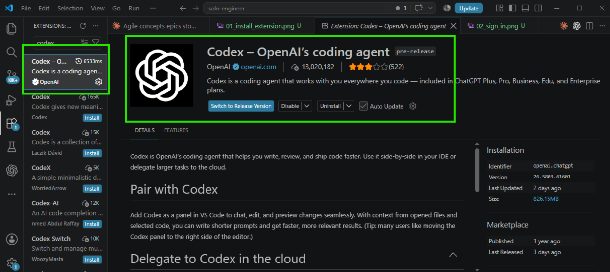

### Step 3: Sign In to Codex

1. After installation, the **CODEX** panel will appear in the left sidebar
2. Click on the Codex icon
3. Sign in with your OpenAI account credentials
4. Authorize the extension

### Step 4: Verify Installation

1. You should see the Codex chat panel with **"Do anything"** input box at the bottom
2. The bottom bar shows the Codex version (e.g., **5.6 Terra**)
3. Chat history appears in the left panel under **Chats**
4. Try typing a simple message to confirm the extension is working

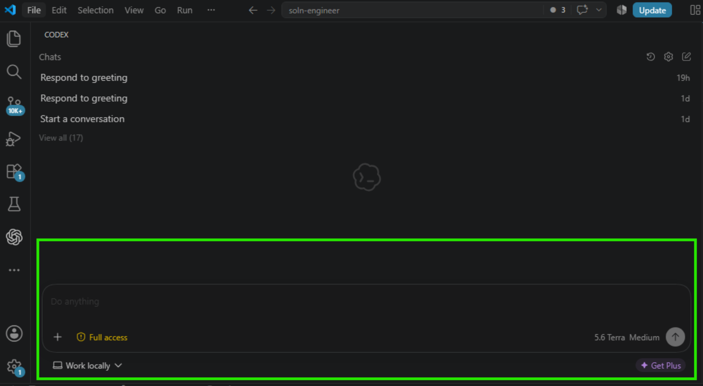

---

## 6. Open Codex Settings

### Step 5: Navigate to Settings

1. Click the **gear icon** at the top of the Codex chat panel
2. Select **"Codex settings"** from the dropdown menu

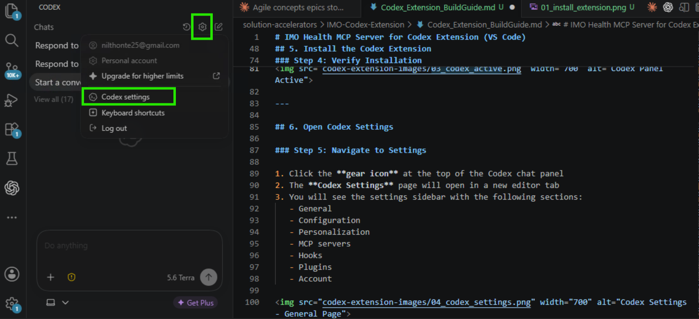

3. The **Codex Settings** page will open in a new editor tab
4. You will see the settings sidebar with the following sections:
   - General
   - Configuration
   - Personalization
   - MCP servers
   - Hooks
   - Plugins
   - Account

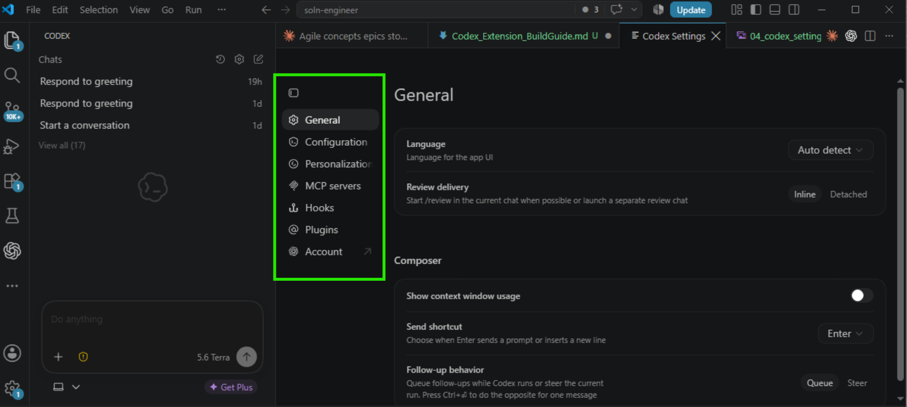

---

## 7. Configure the IMO Health MCP Server

### Step 6: Navigate to MCP Servers

1. In the Codex Settings sidebar, click **"MCP servers"**
2. You will see the MCP servers configuration page
3. Click **"+ Add server"**

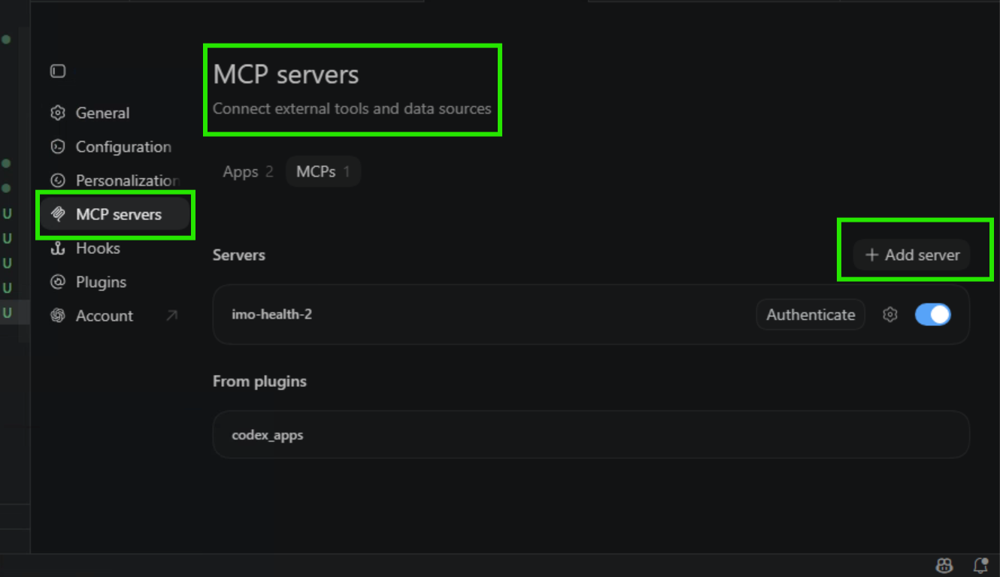

### Step 7: Add IMO Health MCP Server

Fill in the following details:

| Field | Value |
|---|---|
| Server Name | `imo-health-mcp-gateway` |
| Server URL | `https://api.imohealth.com/mcp` |
| Transport | Streamable HTTP |

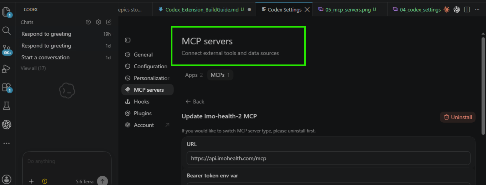

### Step 8: Configure Authentication

1. Set the **Bearer token env var** (e.g., `MCP_BEARER_TOKEN`)
2. Under **Headers from environment variables**, add:

| Key | Value |
|---|---|
| `IMO_CLIENT_ID` | `<Connect with IMO Health to obtain credentials>` |
| `MCP_CLIENT_SECRET` | `<Connect with IMO Health to obtain credentials>` |

3. Click **Save** after entering all details

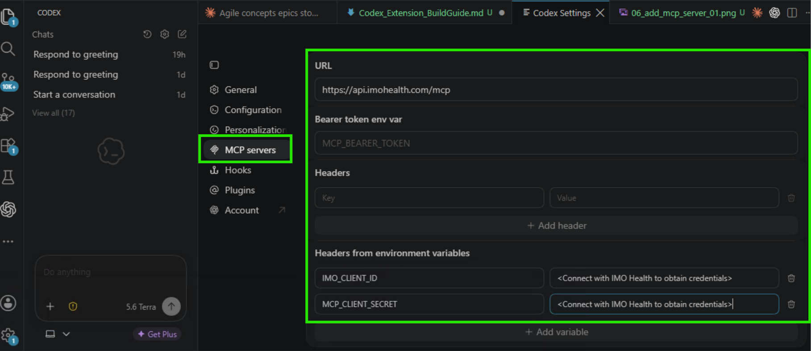

### Step 9: Authenticate with IMO Health

1. After saving, click **"Authenticate"** next to the imo-health server entry
2. VS Code will prompt: "Do you want Code to open the external website?"
3. Click **"Open"** to proceed

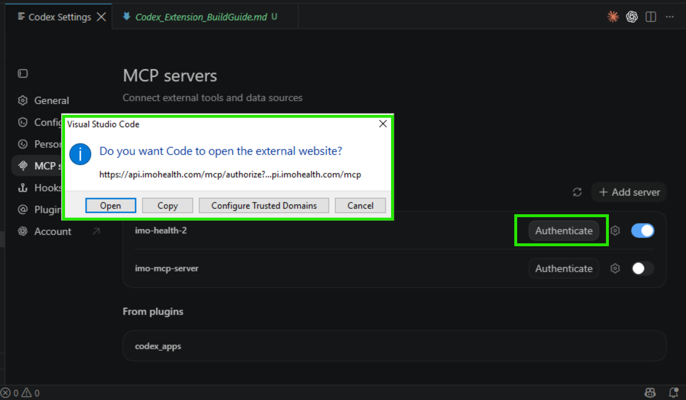

4. Your browser will open to the IMO Health login page
5. Enter your **Email** and **Password**
6. Click **LOGIN**


### Step 10: Verify MCP Connection

1. After successful login, the browser displays **"Authentication complete. You may close this window."**

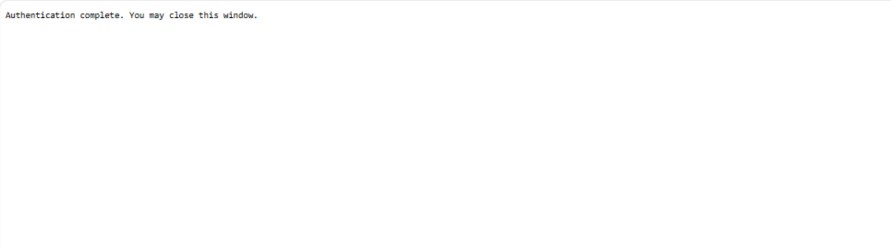

2. Return to Visual Studio Code
3. In Codex Settings → MCP servers, verify **imo-health** shows as **Enabled** with authentication status
4. If you see a "Reconnect" banner, click **Reconnect** to refresh the session

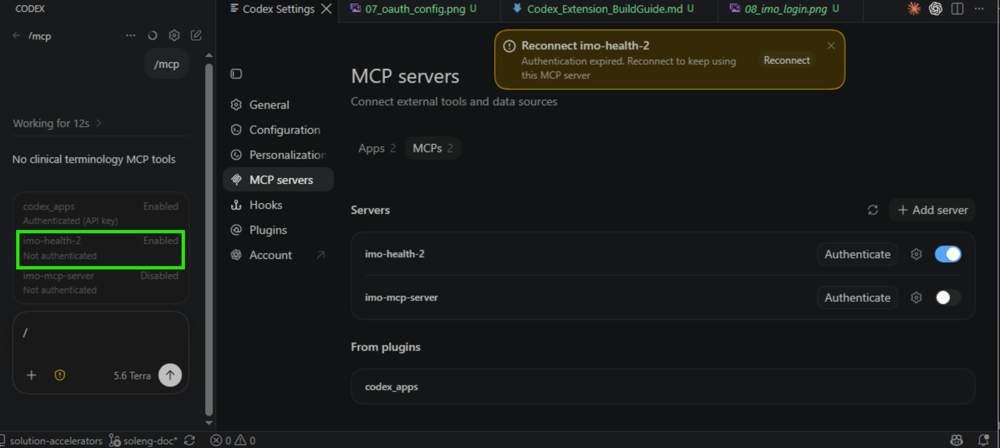

---

## 8. Available MCP Tools

Once connected, the following tools are available from the IMO Health MCP server:

---

#### 1. `mcp__imo-health__ccp___entity_extraction`

**Description:** Extract clinical entities (problems, medications, labs, allergens) from free text using IMO CCP NLP. Analyzes clinical text to identify medical entities with semantic information and code mappings to ICD-10-CM, SNOMED, UMLS, and IMO terminologies.

**Parameters:**

| Parameter | Type | Required | Description |
|---|---|---|---|
| `text` | string | Yes | Clinical text to extract entities from, such as a discharge summary or progress note. |
| `version` | string | No | API version. Default: 3.0. |

---

#### 2. `mcp__imo-health__core-search___search_medical_term`

**Description:** Search for medical terms using the IMO Core Search API (ProblemIT Professional). Returns ranked search results with IMO lexical codes, titles, and mapped codes (ICD-10-CM, SNOMED CT, HCC risk categories). Use the returned IMO lexical codes with get_term_detail for supplemental information, or with the Knowledge Graph get_lexical tool for modifier/refinement data.

**Parameters:**

| Parameter | Type | Required | Description |
|---|---|---|---|
| `search_term` | string | Yes | The medical term to search for, such as 'chest pain' or 'diabetes'. |
| `number_of_results` | integer | No | Maximum number of search results to return. Default: 10. |

---

#### 3. `mcp__imo-health__core-search___get_term_detail`

**Description:** Get detailed supplemental information for IMO lexical codes via the Core Search API. Returns the full detail payload for each code, including mapped codes (ICD-10-CM, SNOMED CT), HCC risk categories, and clinical attributes. Use IMO lexical codes obtained from search_medical_term or normalize_medical_term results.

**Parameters:**

| Parameter | Type | Required | Description |
|---|---|---|---|
| `codes` | string | Yes | Comma-separated IMO lexical codes to get details |

---

#### 4. `mcp__imo-health__core-search___lookup_term_by_code`

**Description:** Look up medical terms by their IMO lexical codes using the Core Search API. Returns the search payload for each known IMO lexical code, including the term title, ICD-10-CM/SNOMED mappings, and clinical attributes. Use this when you already have IMO lexical codes (e.g., from normalize_medical_term) and need the Core Search terminology data for those codes.

**Parameters:**

| Parameter | Type | Required | Description |
|---|---|---|---|
| `codes` | string | Yes | Comma-separated IMO lexical codes to look up |

---

#### 5. `mcp__imo-health__normalize-ppml___normalize_ppml_term`

**Description:** Normalize medical terms using the IMO Precision Normalize API across Problem, Procedure, Medication, and Lab domains. Send one or more medical terms and receive raw normalization results from the API. For Medication domain, returns 20 results per term. For Problem, Procedure, and Lab domains, returns 1 result per term.

**Parameters:**

| Parameter | Type | Required | Description |
|---|---|---|---|
| `terms` | array of strings | Yes | List of medical terms to normalize, such as ['diabetes', 'chest pain', 'amoxicillin', 'CBC']. |
| `domain` | string | Yes | The domain of the medical terms. Must be one of: 'Problem', 'Procedure', 'Medication', or 'Lab'. |

---

#### 6. `mcp__imo-health__categorize___categorize_problems`

**Description:** Organize a list of clinical problems into intuitive disease categories. Groups related conditions together using IMO clinical intelligence to declutter problem lists. Useful for patient chart review and clinical summaries.

**Parameters:**

| Parameter | Type | Required | Description |
|---|---|---|---|
| `problems` | array of objects | Yes | List of problems to categorize. Each problem is an object with keys such as id, title, lexical_code, icd10, and snomed. At least one of title, icd10, or snomed is required. |
| `priority_specialty` | string or null | No | Optional provider specialty code to prioritize in category ordering. |

---

#### 7. `mcp__imo-health__graphql-modifier___get_allowed_refinements`

**Description:** Look up allowed refinements (also known as modifiers) for an IMO Problem lexical in the Knowledge Graph. Returns the refinement group(s) and refinement option(s) that can be applied to make the IMO lexical more specific (e.g., laterality, chronicity, location). Each allowed refinement includes its group code and title for categorization.

**Important:** Use the lexical_code value from normalize_medical_term results as the code parameter (NOT the imo_code). Allowed refinements are only available for the 'problem' domain.

**Parameters:**

| Parameter | Type | Required | Description |
|---|---|---|---|
| `imo_lexical_code` | string | Yes | The lexical_code from normalize_medical_term results, such as 'imo_code' for knee pain. |
| `domain` | string | No | The lexical domain. Default: 'problem'. |

---

#### 8. `mcp__imo-health__graphql-modifier___get_cross_domain`

**Description:** Discover cross-domain clinical relationships for an IMO Problem lexical in the Knowledge Graph. Returns clinical relationships linked to the problem across other domains: associated diagnostics/findings/procedures/lab procedures, treatments (primary/supportive/preventative/contraindicated medications), causative agents and due-to causes (etiology), temporally-related concepts (during/after/before), realizations, finding methods, routine lab procedures, and interpreted procedures.

**Important:** Use the lexical_code value from normalize_medical_term results as the code parameter (NOT the imo_code).

**Parameters:**

| Parameter | Type | Required | Description |
|---|---|---|---|
| `imo_lexical_code` | string | Yes | The lexical_code from normalize_medical_term results, such as 'imo_code' for carcinoma of right breast or 'imo_code' for Crohn's disease. |

---

#### 9. `mcp__imo-health__graphql-modifier___get_lexical`

**Description:** Look up an IMO lexical in the IMO Health Knowledge Graph by its lexical code. Returns the title, broader (parent) concepts, applied refinements (refinements already reflected in the lexical), and allowed refinements grouped by category. Use the allowed refinements to understand what options can increase diagnostic specificity.

**Important:** Use the lexical_code value from normalize_medical_term results as the code parameter (NOT the imo_code). Applied refinements and allowed refinements are only available for the 'problem' domain.

**Parameters:**

| Parameter | Type | Required | Description |
|---|---|---|---|
| `imo_lexical_code` | string | Yes | The lexical_code from normalize_medical_term results, such as 'imo_code' |
| `domain` | string | No | The lexical domain. Default: 'problem'. |

---

#### 10. `mcp__imo-health__graphql-modifier___get_mappings`

**Description:** Retrieve external code mappings for an IMO lexical from the Knowledge Graph. Returns equivalent codes in industry standard coding systems. Problem: ICD-10-CM, ICD-10-CA, ICD-9-CM, SNOMED CT, DSM-5, ICD-O, MONDO. Procedure: CPT, HCPCS, ICD-10-PCS, LOINC, SNOMED CT. Medication: RxNorm, NDC, CVX, SNOMED CT. Each mapping includes the code, title, code system, and relationship type (exactMatch, closeMatch, broadMatch, narrowMatch, relatedMatch).

**Important:** Use the lexical_code value from normalize_medical_term results as the code parameter (NOT the imo_code).

**Parameters:**

| Parameter | Type | Required | Description |
|---|---|---|---|
| `imo_lexical_code` | string | Yes | The lexical_code from normalize_medical_term results, such as 'imo_code' for knee pain. |
| `domain` | string | No | The lexical domain: 'problem' (default), 'procedure', or 'medication'. |
| `code_systems` | array of strings or null | No | Optional list of code systems to filter by, such as icd10cm, snomedInternational, rxnorm, or cpt. |
| `include_hcc` | boolean | No | Problem domain only. If true, include HCC data on ICD-10-CM mappings. Default: false. |

---

#### 11. `mcp__imo-health__graphql-modifier___get_narrower_hierarchy`

**Description:** Explore the hierarchy of an IMO lexical in the Knowledge Graph — both up and down. Returns two levels of broader (parent, grandparent) and two levels of narrower (children, grandchildren) IMO lexicals from the problem hierarchy. Use this to navigate the hierarchy and identify related terms at different specificity levels.

**Important:** Use the lexical_code value from normalize_medical_term results as the code parameter (NOT the imo_code). The problem hierarchy is only available for the 'problem' domain.

**Parameters:**

| Parameter | Type | Required | Description |
|---|---|---|---|
| `imo_lexical_code` | string | Yes | The lexical_code from normalize_medical_term results, such as 'imo_code' for knee pain. |
| `domain` | string | No | The lexical domain. Default: 'problem'. |

---

#### 12. `mcp__imo-health__graphql-modifier___get_narrower_sequential_refinements`

**Description:** Apply refinements as nested GraphQL traversal to find progressively more specific IMO lexicals. Builds a single nested GraphQL query where each refinement level creates a deeper narrower() call. The depth of nesting is determined dynamically by the length of refinement sequence. Ideal for agents that need to drill down through multiple refinement levels in a single query.

**Important:** Use the lexical_code value from normalize_medical_term results as the code parameter (NOT the imo_code).

**Parameters:**

| Parameter | Type | Required | Description |
|---|---|---|---|
| `imo_lexical_code` | string | Yes | The starting lexical_code from normalize_medical_term results, such as 'imo_code' |
| `refinement_sequence` | array of arrays of strings | Yes | Ordered sequence of refinement code lists to apply as nested filters. Example: 'imo_code' creates three levels of nesting. |
| `domain` | string | No | The lexical domain. Default: 'problem'. |
| `include_allowed_refinements` | boolean | No | If true, include allowedRefinements at every nesting level. Default: false. |
| `include_mappings` | boolean | No | If true, include code mappings such as ICD-10 and SNOMED at the deepest level. Default: false. |

---

#### 13. `mcp__imo-health__graphql-modifier___get_narrower_with_refinements`

**Description:** Get narrower IMO lexicals filtered by specific refinement criteria. Returns only the narrower (more specific) IMO lexicals that match the given refinement codes. Use this after calling get_allowed_refinements to filter children by specific refinement options (e.g., find all knee pain variants with laterality:right).

**Important:** Use the lexical_code value from normalize_medical_term results as the code parameter (NOT the imo_code). Applied refinements are only available for the 'problem' domain.

**Parameters:**

| Parameter | Type | Required | Description |
|---|---|---|---|
| `imo_lexical_code` | string | Yes | The lexical_code from normalize_medical_term results, such as 'imo_code' for knee pain. |
| `refinement_codes` | array of strings | Yes | List of refinement codes to filter narrower lexicals by, such as 'imo_code' for laterality:right. |
| `domain` | string | No | The lexical domain. Default: 'problem'. |

---

#### 14. `mcp__imo-health__graphql-modifier___get_refinement_group`

**Description:** Look up all refinements within a specific refinement group. Returns the group title and all available refinement options within the category. Use this to see all possible values for a refinement type (e.g., all laterality options: right, left, bilateral, unilateral, unspecified). Get the group notation from the group. Code field in get_allowed_refinements or get_lexical results.

**Parameters:**

| Parameter | Type | Required | Description |
|---|---|---|---|
| `notation` | string | Yes | The refinement group notation/code, such as 'imo_code' for laterality. |

---

#### 15. `mcp__imo-health__graphql-modifier___get_related_problems`

**Description:** Find the clinical problems related to a procedure or medication (reverse lookup). Traverses the cross-domain graph in reverse. Procedure: returns associatedProblems, interpretedFindings, determinedProblems, causedProblems, realizedProblems. Medication: returns treatedProblems, contraindicatedProblems, preventedProblems, causedProblems.

**Important:** Use the lexical_code value from normalize_medical_term results as the code parameter (NOT the imo_code).

**Parameters:**

| Parameter | Type | Required | Description |
|---|---|---|---|
| `imo_lexical_code` | string | Yes | The lexical_code of a procedure or medication from normalize_medical_term results. |
| `domain` | string | No | The domain of the input code: 'procedure' or 'medication'. Default: 'procedure'. |

## 9. Test the Connection

### Step 11: Open a New Chat

1. Click on the Codex chat input box (**"Do anything"**)
2. Type a test query:

```
How many tools are there in IMO MCP server to which you are connected?
```

3. Verify the agent responds confirming it is connected to **15 IMO Health MCP tools**

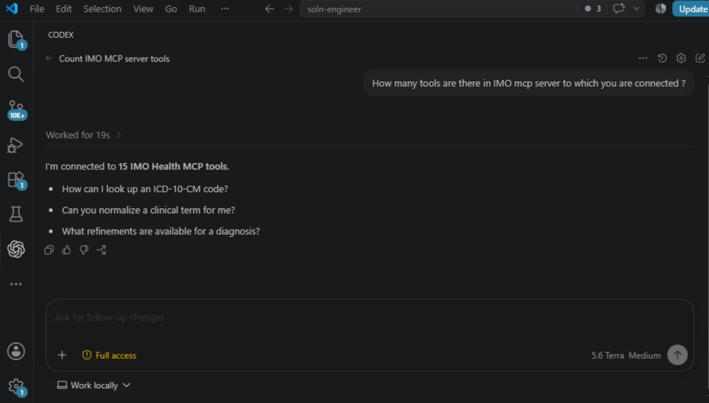

### Step 12: Try Additional Queries

Test with these sample queries to confirm full functionality:

| # | Sample Query | Expected Tools Called |
|---|---|---|
| 1 | "What are the specificity paths for diabetes?" | `normalize_ppml_term` → `get_lexical` → `get_narrower_hierarchy` |
| 2 | "Map SNOMED code 22298006 to ICD-10" | `get_mappings` |
| 3 | "Extract diagnoses from: Patient presents with acute chest pain and shortness of breath" | `entity_extraction` |
| 4 | "What refinements are available for hypertension?" | `normalize_ppml_term` → `get_allowed_refinements` |
| 5 | "Find the most specific ICD-10 code for type 2 diabetes with nephropathy" | `normalize_ppml_term` → `get_lexical` → `get_narrower_sequential_refinements` |

---

## 10. Troubleshooting

| Symptom | Cause | Fix |
|---|---|---|
| MCP server not appearing | Not saved properly | Re-enter details in MCP servers settings and click Save |
| "Needs authentication" | OAuth token expired | Click Authenticate again in MCP server settings |
| Tools not discovered | Connection not established | Check server URL is `https://api.imohealth.com/mcp` and re-authenticate |
| 401 Unauthorized | Invalid credentials | Verify Client ID and Client Secret with IMO Health team |
| Extension not loading | Outdated VS Code | Update Visual Studio Code to latest version |
| "Connection refused" | Firewall or proxy blocking | Check network allows access to `api.imohealth.com` |
| Slow responses | Multiple sequential tool calls | Expected behavior (5-6 tool calls for specificity workflows) |
| Chat not responding | Extension crash | Restart VS Code or reinstall Codex extension |
| OAuth browser doesn't open | Default browser issue | Check that your default browser opens from VS Code |

---

## 11. Quick Reference

| Step | Action | Where |
|---|---|---|
| 1 | Install Codex extension | VS Code → Extensions Marketplace → Search "Codex" → Install |
| 2 | Sign in | Codex panel → Sign in with OpenAI account |
| 3 | Open settings | Codex panel → Gear icon → Codex settings |
| 4 | Add MCP server | Codex Settings → MCP servers → + Add server |
| 5 | Configure auth | MCP server → Enter URL, Bearer token, Headers |
| 6 | Authenticate | Click Authenticate → Open browser → Enter IMO Health credentials |
| 7 | Verify connection | Codex Settings → MCP servers → Enabled status |
| 8 | Test | Codex Chat panel → Ask a clinical terminology query |

---

## 12. Clinical-Use Note

Use the IMO Health MCP server for terminology assistance. Confirm results against the available clinical documentation and applicable organizational coding policies; do not infer undocumented specificity.

---

## Version History

| Date | Version | Change |
|---|---|---|
| 2026-08-12 | 1.0 | Initial Codex VS Code Extension setup guide |
| 2026-08-13 | 1.1 | Fixed image paths and reorganized screenshot placement |
