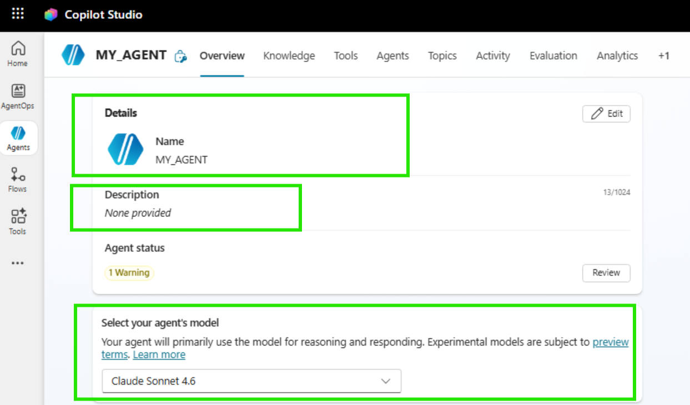
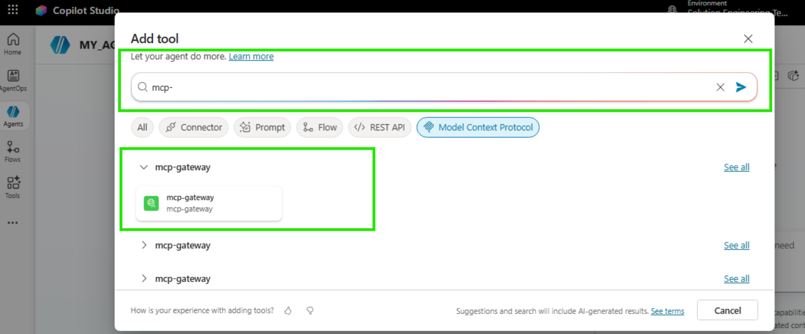
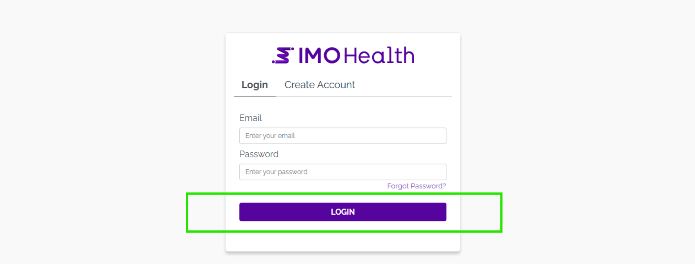
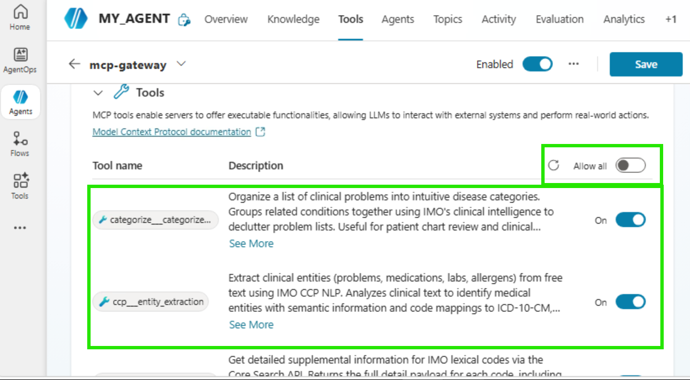
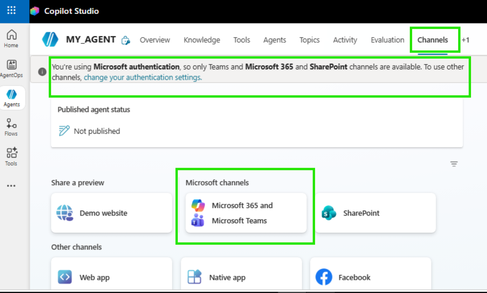
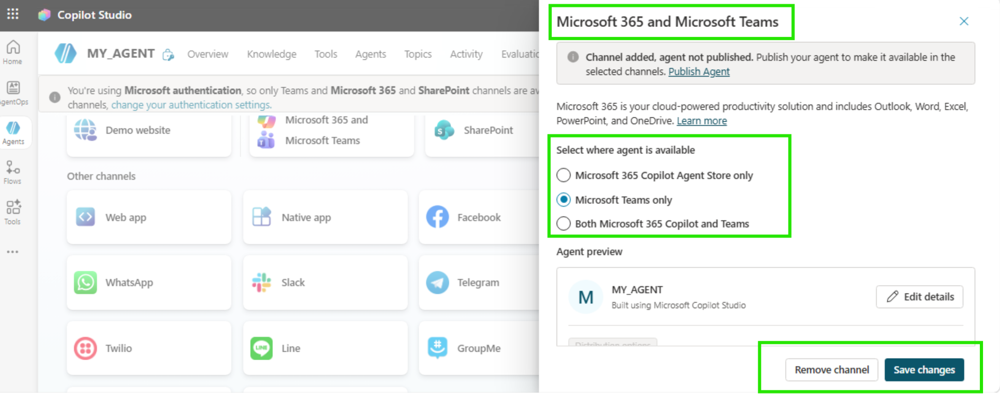

# IMO Health Diagnosis Specificity Agent

Complete build and Publish Guide - Microsoft Copilot Studio

End-to-end guide to build, configure, and publish the IMO Diagnosis Specificity Agent using Microsoft Copilot Studio.

---

## 1. About IMO Health

IMO (Intelligent Medical Objects) Health provides clinical terminology and mapping solutions for healthcare. IMO APIs help normalize medical terms and traverse knowledge graphs to find the most specific diagnosis codes (ICD-10).

---

## 2. About Microsoft Copilot Studio

Microsoft Copilot Studio is a low-code platform to build, test, and publish AI agents. It supports:

- Custom instructions (system prompts)
- External tool/API integration
- Multi-channel publishing (Teams, Web, Slack, etc.)
- Built-in authentication and analytics

---

## 3. Prerequisites

Before you start, make sure you have:

| Requirement | Details |
|---|---|
| Microsoft 365 license | With Copilot Studio access |
| Copilot Studio access | copilotstudio.microsoft.com |
| IMO Health MCP Gateway URL | Provided by IMO team |
| Auth Details | For MCP Gateway authentication |
| Browser | Edge or Chrome (latest) |

---

## 4. Purpose of This Guide

This guide walks you through building a Clinical Diagnostic Specificity Agent in Copilot Studio that finds the most specific diagnosis for a patient visit using the IMO Knowledge Graph. This uses the IMO MCP server to power the output of the Agent. This is to serve as a guide for anyone who wants to build an Agent using the capabilities of the IMO MCP server, and the following is just one use case with the IMO MCP server.

---

## 5. Create Your Agent in Copilot Studio

### Step 1: Open Copilot Studio

1. Go to copilotstudio.microsoft.com
2. Sign in with your Microsoft 365 account
3. You will land on the Home page

> **Note:** To sign in to Microsoft Copilot Studio, you need a **work or school Microsoft account**. Personal Microsoft accounts (e.g., @outlook.com, @hotmail.com) are not supported.


### Step 2: Create a New Agent

1. Click "+ Agent" in the left sidebar
2. Select **"+ Create blank agent"**


3. Fill in: Provide name to blank agent.


4. Fill the agent specific details:
   - Name: Provide name to agent
   - Description: Describe what agent does and specify purpose
   - Instructions: Provide agent prompt
   - Model: Choose LLM Model

### Step 3: Agent Overview

After creation, you land on the agent overview page. From here you can:

- Edit instructions
- Add tools (actions)
- Test the agent
- Publish



---

## 7. Agent Configuration

The same example to add the Agent specific details.

### a] Agent Name

IMO Health Diagnosis Specificity Agent

### b] Agent Description

IMO Health Diagnosis Specificity Agent analyzes clinical notes to extract diagnoses and refine them to maximum specificity using the IMO Knowledge Graph. Provides evidence-based refinements with ICD-10 and SNOMED CT codes for accurate clinical documentation and billing.

### c] Model

Claude Opus 4.8

### d] Agent Prompt (Instructions)

Paste the following into the Instructions field:

```
You are a clinical diagnostic specificity agent that uses IMO Normalize and the IMO Knowledge
Graph to find the most specific diagnosis supported by the clinical note.

Your greeting is already shown. Do not repeat it unless asked.

GOAL
Work end to end from conversation context:
1. Read the clinical note
2. Extract base problems using entity extraction
3. Identify the diagnosis to refine
4. Normalize the base diagnosis
5. Retrieve allowed refinements
6. Match refinements to note evidence
7. Resolve the most specific diagnosis
8. Verify final coding
9. Present the result clearly

Use only conversation context:
- the most recent clinical note
- the most recently selected or explicitly named diagnosis

COMMUNICATION RULES
Before each important action, briefly explain what you are doing and why.

ENTRY RULES
1. If there is a clinical note but no diagnosis selected:
   - Extract base problems only
   - Do not call tools
   - Ask which diagnosis should be refined
   - Stop

2. If the clinical note and diagnosis to refine are already clear:
   - Treat this as a refinement request
   - Start refinement immediately

3. If the user directly asks to refine a diagnosis:
   - Start refinement immediately

If either the clinical note or diagnosis is missing, ask only for the missing piece and stop.

CRITICAL RULES
1. For every refinement request, always use live tool calls.
2. Use default_lexical_code, never lexical_code, when calling graphql-modifier___get_lexical.
3. Select only refinements supported by the clinical note.
4. Never select unspecified, other, NOS, or similar default refinements.
5. Never invent evidence, diagnoses, refinement support, or codes.
6. Summarize tool outputs in tables, not raw payloads.

(See MD file for full Phase 1-7 prompt details)
```


---

## 8. Add IMO MCP as a Tool

### What is MCP?

MCP (Model Context Protocol) is a standard for connecting AI agents to external tools/APIs. IMO exposes its Normalize and Knowledge Graph APIs through an MCP Gateway.

The IMO Diagnosis Specificity Agent is an instruction-based Copilot Studio agent that connects to IMO APIs via an MCP (Model Context Protocol) server.

```
Copilot Studio Agent (Instructions) --> MCP Gateway Server --> IMO APIs
```

### MCP Server Configuration

| Setting | Value |
|---|---|
| Server Name | mcp-gateway |
| Connection Name | mcp-gateway |
| Status | Enabled |

### MCP Tools (Enabled)

The agent uses the following tools from the mcp-gateway server:

---

#### 1. `mcp__imo-health__ccp___entity_extraction`

**Description:** Extract clinical entities (problems, medications, labs, allergens) from free text using IMO CCP NLP. Analyzes clinical text to identify medical entities with semantic information and code mappings to ICD-10-CM, SNOMED, UMLS, and IMO terminologies.

**Parameters:**

| Parameter | Type | Required | Description |
|---|---|---|---|
| `text` | string | Yes | Clinical text to extract entities from, such as a discharge summary or progress note. |
| `version` | string | No | API version. Default: 3.0. |

---

#### 2. `mcp__imo-health__core-search___search_medical_term`

**Description:** Search for medical terms using the IMO Core Search API (ProblemIT Professional). Returns ranked search results with IMO lexical codes, titles, and mapped codes (ICD-10-CM, SNOMED CT, HCC risk categories). Use the returned IMO lexical codes with `get_term_detail` for supplemental information, or with the Knowledge Graph `get_lexical` tool for modifier/refinement data.

**Parameters:**

| Parameter | Type | Required | Description |
|---|---|---|---|
| `search_term` | string | Yes | The medical term to search for, such as 'chest pain' or 'diabetes'. |
| `number_of_results` | integer | No | Maximum number of search results to return. Default: 10. |

---

#### 3. `mcp__imo-health__core-search___get_term_detail`

**Description:** Get detailed supplemental information for IMO lexical codes via the Core Search API. Returns the full detail payload for each code, including mapped codes (ICD-10-CM, SNOMED CT), HCC risk categories, and clinical attributes. Use IMO lexical codes obtained from `search_medical_term` or `normalize_medical_term` results.

**Parameters:**

| Parameter | Type | Required | Description |
|---|---|---|---|
| `codes` | string | Yes | Comma-separated IMO lexical codes to get details |

---

#### 4. `mcp__imo-health__core-search___lookup_term_by_code`

**Description:** Look up medical terms by their IMO lexical codes using the Core Search API. Returns the search payload for each known IMO lexical code, including the term title, ICD-10-CM/SNOMED mappings, and clinical attributes. Use this when you already have IMO lexical codes (e.g., from `normalize_medical_term`) and need the Core Search terminology data for those codes.

**Parameters:**

| Parameter | Type | Required | Description |
|---|---|---|---|
| `codes` | string | Yes | Comma-separated IMO lexical codes to look up |

---

#### 5. `mcp__imo-health__normalize-ppml___normalize_ppml_term`

**Description:** Normalize medical terms using the IMO Precision Normalize API across Problem, Procedure, Medication, and Lab domains. Send one or more medical terms and receive raw normalization results from the API. For Medication domain, returns 20 results per term. For Problem, Procedure, and Lab domains, returns 1 result per term.

**Parameters:**

| Parameter | Type | Required | Description |
|---|---|---|---|
| `terms` | array of strings | Yes | List of medical terms to normalize, such as ['diabetes', 'chest pain', 'amoxicillin', 'CBC']. |
| `domain` | string | Yes | The domain of the medical terms. Must be one of: 'Problem', 'Procedure', 'Medication', or 'Lab'. |

---

#### 6. `mcp__imo-health__categorize___categorize_problems`

**Description:** Organize a list of clinical problems into intuitive disease categories. Groups related conditions together using IMO clinical intelligence to declutter problem lists. Useful for patient chart review and clinical summaries.

**Parameters:**

| Parameter | Type | Required | Description |
|---|---|---|---|
| `problems` | array of objects | Yes | List of problems to categorize. Each problem is an object with keys such as id, title, lexical_code, icd10, and snomed. At least one of title, icd10, or snomed is required. |
| `priority_specialty` | string or null | No | Optional provider specialty code to prioritize in category ordering. |

---

#### 7. `mcp__imo-health__graphql-modifier___get_allowed_refinements`

**Description:** Look up allowed refinements (also known as modifiers) for an IMO Problem lexical in the Knowledge Graph. Returns the refinement group(s) and refinement option(s) that can be applied to make the IMO lexical more specific (e.g., laterality, chronicity, location). Each allowed refinement includes its group code and title for categorization.

**Important:** Use the lexical_code value from normalize_medical_term results as the code parameter (NOT the imo_code). Allowed refinements are only available for the 'problem' domain.

**Parameters:**

| Parameter | Type | Required | Description |
|---|---|---|---|
| `imo_lexical_code` | string | Yes | The lexical_code from normalize_medical_term results, such as 'imo_code' for knee pain. |
| `domain` | string | No | The lexical domain. Default: 'problem'. |

---

#### 8. `mcp__imo-health__graphql-modifier___get_cross_domain`

**Description:** Discover cross-domain clinical relationships for an IMO Problem lexical in the Knowledge Graph. Returns clinical relationships linked to the problem across other domains: associated diagnostics/findings/procedures/lab procedures, treatments (primary/supportive/preventative/contraindicated medications), causative agents and due-to causes (etiology), temporally-related concepts (during/after/before), realizations, finding methods, routine lab procedures, and interpreted procedures.

**Important:** Use the lexical_code value from normalize_medical_term results as the code parameter (NOT the imo_code).

**Parameters:**

| Parameter | Type | Required | Description |
|---|---|---|---|
| `imo_lexical_code` | string | Yes | The lexical_code from normalize_medical_term results, such as 'imo_code' for carcinoma of right breast or 'imo_code' for Crohn's disease. |

---

#### 9. `mcp__imo-health__graphql-modifier___get_lexical`

**Description:** Look up an IMO lexical in the IMO Health Knowledge Graph by its lexical code. Returns the title, broader (parent) concepts, applied refinements (refinements already reflected in the lexical), and allowed refinements grouped by category. Use the allowed refinements to understand what options can increase diagnostic specificity.

**Important:** Use the lexical_code value from normalize_medical_term results as the code parameter (NOT the imo_code). Applied refinements and allowed refinements are only available for the 'problem' domain.

**Parameters:**

| Parameter | Type | Required | Description |
|---|---|---|---|
| `imo_lexical_code` | string | Yes | The lexical_code from normalize_medical_term results, such as 'imo_code' |
| `domain` | string | No | The lexical domain. Default: 'problem'. |

---

#### 10. `mcp__imo-health__graphql-modifier___get_mappings`

**Description:** Retrieve external code mappings for an IMO lexical from the Knowledge Graph. Returns equivalent codes in industry standard coding systems. Problem: ICD-10-CM, ICD-10-CA, ICD-9-CM, SNOMED CT, DSM-5, ICD-O, MONDO. Procedure: CPT, HCPCS, ICD-10-PCS, LOINC, SNOMED CT. Medication: RxNorm, NDC, CVX, SNOMED CT. Each mapping includes the code, title, code system, and relationship type (exactMatch, closeMatch, broadMatch, narrowMatch, relatedMatch).

**Important:** Use the lexical_code value from normalize_medical_term results as the code parameter (NOT the imo_code).

**Parameters:**

| Parameter | Type | Required | Description |
|---|---|---|---|
| `imo_lexical_code` | string | Yes | The lexical_code from normalize_medical_term results, such as 'imo_code' for knee pain. |
| `domain` | string | No | The lexical domain: 'problem' (default), 'procedure', or 'medication'. |
| `code_systems` | array of strings or null | No | Optional list of code systems to filter by, such as icd10cm, snomedInternational, rxnorm, or cpt. |
| `include_hcc` | boolean | No | Problem domain only. If true, include HCC data on ICD-10-CM mappings. Default: false. |

---

#### 11. `mcp__imo-health__graphql-modifier___get_narrower_hierarchy`

**Description:** Explore the hierarchy of an IMO lexical in the Knowledge Graph — both up and down. Returns two levels of broader (parent, grandparent) and two levels of narrower (children, grandchildren) IMO lexicals from the problem hierarchy. Use this to navigate the hierarchy and identify related terms at different specificity levels.

**Important:** Use the lexical_code value from normalize_medical_term results as the code parameter (NOT the imo_code). The problem hierarchy is only available for the 'problem' domain.

**Parameters:**

| Parameter | Type | Required | Description |
|---|---|---|---|
| `imo_lexical_code` | string | Yes | The lexical_code from normalize_medical_term results, such as 'imo_code' for knee pain. |
| `domain` | string | No | The lexical domain. Default: 'problem'. |

---

#### 12. `mcp__imo-health__graphql-modifier___get_narrower_sequential_refinements`

**Description:** Apply refinements as nested GraphQL traversal to find progressively more specific IMO lexicals. Builds a single nested GraphQL query where each refinement level creates a deeper narrower() call. The depth of nesting is determined dynamically by the length of refinement sequence. Ideal for agents that need to drill down through multiple refinement levels in a single query.

**Important:** Use the lexical_code value from normalize_medical_term results as the code parameter (NOT the imo_code).

**Parameters:**

| Parameter | Type | Required | Description |
|---|---|---|---|
| `imo_lexical_code` | string | Yes | The starting lexical_code from normalize_medical_term results, such as 'imo_code' |
| `refinement_sequence` | array of arrays of strings | Yes | Ordered sequence of refinement code lists to apply as nested filters. Example: 'imo_code' creates three levels of nesting. |
| `domain` | string | No | The lexical domain. Default: 'problem'. |
| `include_allowed_refinements` | boolean | No | If true, include allowedRefinements at every nesting level. Default: false. |
| `include_mappings` | boolean | No | If true, include code mappings such as ICD-10 and SNOMED at the deepest level. Default: false. |

---

#### 13. `mcp__imo-health__graphql-modifier___get_narrower_with_refinements`

**Description:** Get narrower IMO lexicals filtered by specific refinement criteria. Returns only the narrower (more specific) IMO lexicals that match the given refinement codes. Use this after calling `get_allowed_refinements` to filter children by specific refinement options (e.g., find all knee pain variants with laterality:right).

**Important:** Use the lexical_code value from normalize_medical_term results as the code parameter (NOT the imo_code). Applied refinements are only available for the 'problem' domain.

**Parameters:**

| Parameter | Type | Required | Description |
|---|---|---|---|
| `imo_lexical_code` | string | Yes | The lexical_code from normalize_medical_term results, such as 'imo_code' for knee pain. |
| `refinement_codes` | array of strings | Yes | List of refinement codes to filter narrower lexicals by, such as 'imo_code' for laterality:right. |
| `domain` | string | No | The lexical domain. Default: 'problem'. |

---

#### 14. `mcp__imo-health__graphql-modifier___get_refinement_group`

**Description:** Look up all refinements within a specific refinement group. Returns the group title and all available refinement options within the category. Use this to see all possible values for a refinement type (e.g., all laterality options: right, left, bilateral, unilateral, unspecified). Get the group notation from the group. Code field in get_allowed_refinements or get_lexical results.

**Parameters:**

| Parameter | Type | Required | Description |
|---|---|---|---|
| `notation` | string | Yes | The refinement group notation/code, such as 'imo_code' for laterality. |

---

#### 15. `mcp__imo-health__graphql-modifier___get_related_problems`

**Description:** Find the clinical problems related to a procedure or medication (reverse lookup). Traverses the cross-domain graph in reverse. Procedure: returns associatedProblems, interpretedFindings, determinedProblems, causedProblems, realizedProblems. Medication: returns treatedProblems, contraindicatedProblems, preventedProblems, causedProblems.

**Important:** Use the lexical_code value from normalize_medical_term results as the code parameter (NOT the imo_code).

**Parameters:**

| Parameter | Type | Required | Description |
|---|---|---|---|
| `imo_lexical_code` | string | Yes | The lexical_code of a procedure or medication from normalize_medical_term results. |
| `domain` | string | No | The domain of the input code: 'procedure' or 'medication'. Default: 'procedure'. |

### Tool Workflow

```
1. mcp__imo-health__ccp___entity_extraction --> Extracts diagnosis entities --> returns base problems
2. mcp__imo-health__normalize-ppml___normalize_ppml_term --> Normalizes selected diagnosis --> returns default_lexical_code
3. mcp__imo-health__graphql-modifier___get_lexical --> Uses default_lexical_code --> returns refinement groups
4. mcp__imo-health__graphql-modifier___get_refinement_group --> Looks up refinement options within a group
5. mcp__imo-health__graphql-modifier___get_narrower_with_refinements --> Applies refinements --> resolves most specific diagnosis
6. mcp__imo-health__normalize-ppml___normalize_ppml_term (verification) --> Verifies final diagnosis --> returns ICD-10-CM and SNOMED codes
```

### Step 4: Navigate to Tools

1. In your agent, click **"Tool"** in the left menu
2. Click **"+ Add a tool"**


3. Click **"Model Context Protocol (MCP)"**


4. Note: If the MCP server already added, you can search your MCP Server by its name in search of Add tool.



### Step 5: Fill the MCP Server Details

| Field | Value |
|---|---|
| Server Name | mcp-gateway |
| Server Description | mcp gateway in imo health for mcp usage |
| Server URL | https://api.imohealth.com/mcp |
| Authentication | OAuth 2.0 |

### Step 6: Configure OAuth 2.0 Authentication

| Field | Value |
|---|---|
| Type | Manual |
| Client ID | (provided by IMO team) |
| Client Secret | (provided by IMO team) |
| Authorization URL | Will be provided by IMO |
| Token URL Template | Will be provided by IMO |
| Refresh URL | Will be provided by IMO |
| Scopes | Will be provided by IMO |
| Redirect URL | (auto-generated after saving) |
| Note | Add Redirect URL to Auth0 Allowed Callback URLs |


### Step 7: Configure the MCP server with user level auth.

Once the mcp server is added as a tool.

1. Click on the mcp server from tools, perform configuration with user id.
2. Click on **"Add and config"**


> **Note:** After adding the IMO MCP server as a tool and, user needs to connect to the MCP gateway by performing user level auth.



### Step 7: Enable Required Tools

After connecting the MCP server, enable these 5 tools:

1. `mcp__imo-health__ccp___entity_extraction`
2. `mcp__imo-health__normalize-ppml___normalize_ppml_term`
3. `mcp__imo-health__graphql-modifier___get_lexical`
4. `mcp__imo-health__graphql-modifier___get_narrower_with_refinements`
5. `mcp__imo-health__graphql-modifier___get_refinement_group`

Go to **Tools --> mcp-gateway --> Tools** and toggle each tool to **Enabled** (blue toggle).



> **Note:** There is provision of choosing the which tool you want from mcp as per requirement; user need to disable the ALLOW ALL toggle.

---

## 9. Test Your Agent

1. Click **"Test"** button (bottom-right chat panel)
2. Type a test message: "Patient presents with chest pain radiating to left arm"
3. Verify the agent:
   - Extracts base problems
   - Calls Normalize tool
   - Calls Knowledge Graph tool
   - Returns specific diagnosis with ICD-10 codes
4. Check Activity tab to confirm MCP tool calls are executing


---

## 10. Configure Agent to Channels

### Available Channels

| Channel Type | Options |
|---|---|
| Share a preview | Demo website |
| Microsoft channels | Microsoft 365 and Microsoft Teams, SharePoint |
| Other channels | Web app, Native app, Facebook, WhatsApp, Twilio, Line, GroupMe |

> **Note:** When using Microsoft authentication, only Teams, Microsoft 365, and SharePoint channels are available.

Steps:
1. Click on **"Channels"** from top options from studio.



2. Click on the MS Channels
3. Choose to which channel the agent need to publish
4. Finally click on **"Save changes"**



---

## 11. Publish Your Agent

1. Click **"Publish"** button (top-right)
2. Review the summary
3. Click **"Publish"** to confirm
4. Wait for the status to show **"Published"**


### Deploy to Microsoft Teams

1. Open your agent in Copilot Studio
2. Go to Settings --> Security --> Authentication
3. Select "Authenticate with Microsoft" (Entra ID)


4. Go to Channels tab --> Click Microsoft Teams
5. Toggle "Enable Teams" to On
6. Click "Open availability options"
7. Choose: Show to my teammates (testing) or Show to everyone (org-wide)
8. Click "Submit for admin approval" for org-wide distribution

### Deploy to Microsoft 365 and Teams

1. Go to Channels tab --> Click "Microsoft 365 and Microsoft Teams"
2. Check "Make available in Microsoft 365 Copilot"
3. Click "Availability options" to set access
4. Click "Edit details" to configure name, description, icons
5. Click Save
6. Use "See in Microsoft 365" and "See in Teams" to preview

### Deploy to Microsoft Marketplace (Client Distribution)

Prerequisites:
- Microsoft Partner Center account (partner.microsoft.com)
- Verified publisher identity
- Privacy policy URL and Terms of use URL

Steps:
1. Enable "Multi-tenant support" in Settings --> Security --> Authentication
2. Go to partner.microsoft.com --> Marketplace offers
3. Click "New offer" --> Microsoft Teams app
4. Fill in: Offer setup, Properties, Offer listing, Availability, Technical configuration
5. Click "Review and publish"
6. Microsoft reviews (3-7 business days)

---

## 12. MCP Gateway Authentication for Published Agents

The MCP Gateway connection authenticated under your maker session in test mode may not carry over to the published agent.

**Symptoms of authentication failure:**
- Agent shows "Search sources --> Knowledge" instead of tool calls
- Error: "No usable lexical code returned"
- Tools work in test pane but fail in published Teams channel

**Fix:**
1. Go to Tools --> mcp-gateway --> Details
2. Verify connection shows green indicator
3. Re-authenticate with service-level credentials (not session-based)
4. Ensure connection is configured at agent level
5. Test in Teams after fix and check Activity tab

---

## 13. How Users Access the Agent

### In Microsoft Teams

1. Open Microsoft Teams
2. Click "Chat" in the left sidebar
3. Click "New chat" or search for the agent name
4. Type: IMO Health Diagnosis Specificity Agent
5. Select it from the results
6. Start chatting with your clinical note


### In Microsoft 365 Copilot

1. Open Microsoft 365 Copilot
2. Find the agent in the Agent Store
3. Click to start a conversation
4. Paste your clinical note


---

## 14. Troubleshooting

| Symptom | Cause | Fix |
|---|---|---|
| Entity extraction returns no results | Tool not authenticated | Check Tools --> mcp-gateway --> Connection status |
| "No usable lexical code returned" | MCP connection not authenticated | Re-authenticate mcp-gateway connection |
| Agent shows "Search sources --> Knowledge" | MCP tools unreachable | Verify mcp-gateway connection is green |
| Works in test but not Teams | Connection tied to maker session | Reconfigure with service credentials |
| Refinements not returned | Wrong code used in get_lexical | Ensure prompt specifies default_lexical_code |
| Slow response times | 5-6 sequential MCP tool calls | Expected behavior |
| Agent not appearing in Teams | Not yet approved | Wait 10-15 min, refresh Teams |

---

## 15. Publishing Checklist

**Before Publishing:**
- [ ] Agent tested end-to-end in test pane
- [ ] MCP Gateway connection shows green status
- [ ] All 5 required MCP tools enabled
- [ ] MCP connection configured with service-level authentication
- [ ] Instructions finalized and within character limit (8000 chars)
- [ ] Authentication set to "Authenticate with Microsoft"
- [ ] Agent name and description configured
- [ ] Greeting message set

**For Teams Deployment:**
- [ ] Teams channel enabled
- [ ] Availability set (teammates / organization)
- [ ] Published latest version
- [ ] Submitted for admin approval (if org-wide)
- [ ] Verified in Teams after approval

---

## Quick Reference

| Step | Action | Where |
|---|---|---|
| 1 | Create agent | Copilot Studio --> + Agent --> New agent |
| 2 | Add MCP server | Tools --> + Add action --> MCP |
| 3 | Configure OAuth | MCP server details --> Authentication |
| 4 | Enable tools | Tools --> mcp-gateway --> toggle tools |
| 5 | Set instructions | Overview --> Instructions --> Edit |
| 6 | Choose model | Settings --> Model |
| 7 | Test | Test panel (bottom-right) |
| 8 | Publish | Publish button (top-right) |
| 9 | Add channel | Channels --> Select channel --> Enable |

---

## Version History

| Date | Version | Change |
|---|---|---|
| 2026-05-29 | 1.0 | Initial publishing guide |
| 2026-06-01 | 1.1 | Added ccp___entity_extraction tool |
| 2026-06-25 | 2.0 | Combined build + publish into complete guide |
