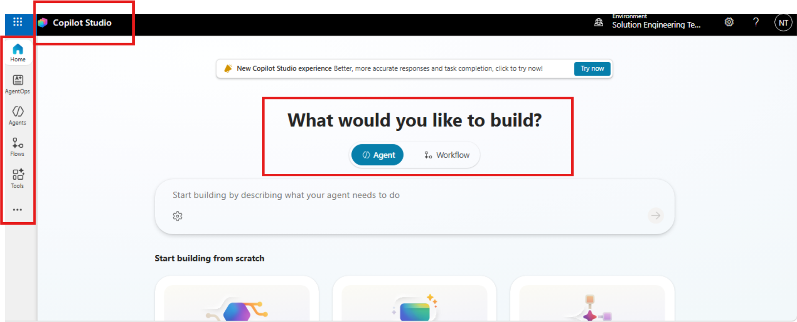
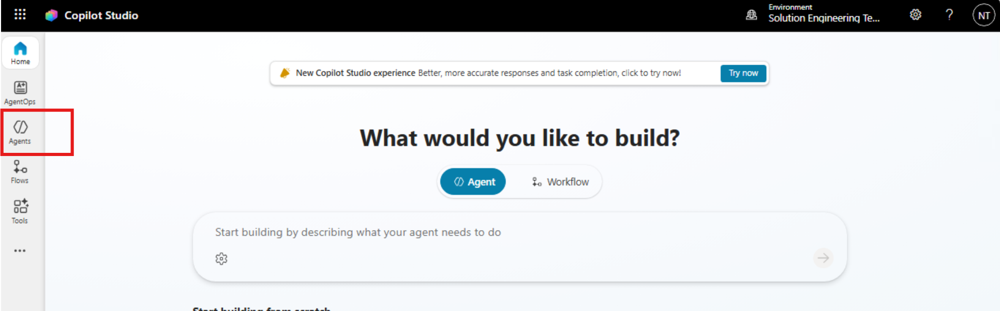
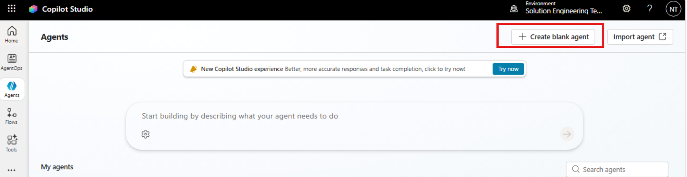
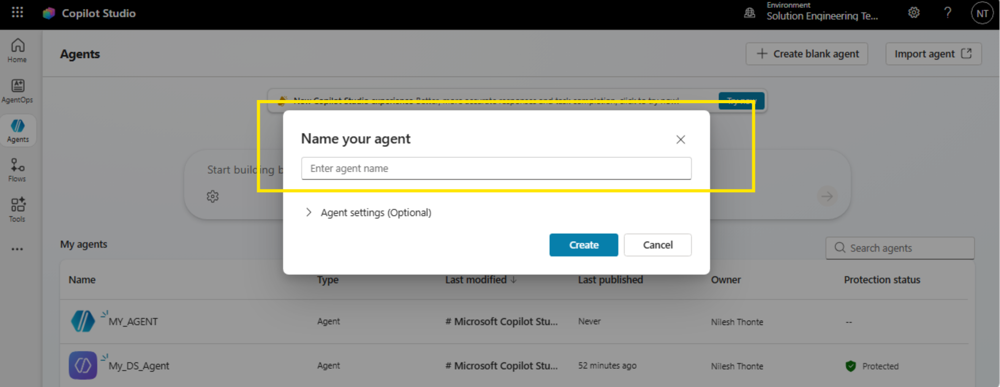
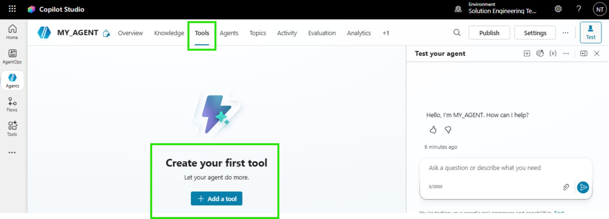
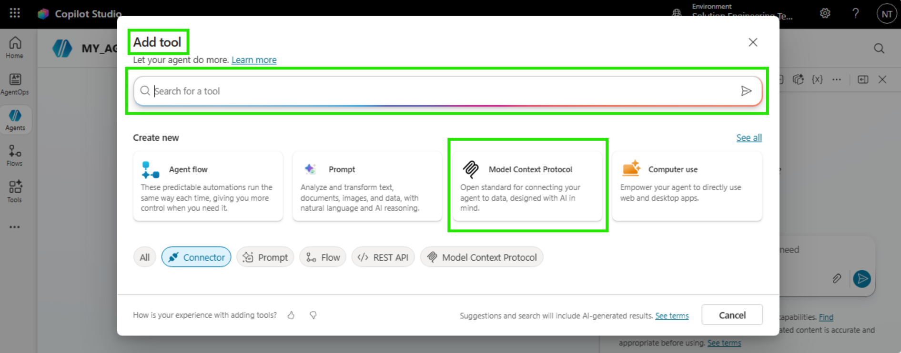
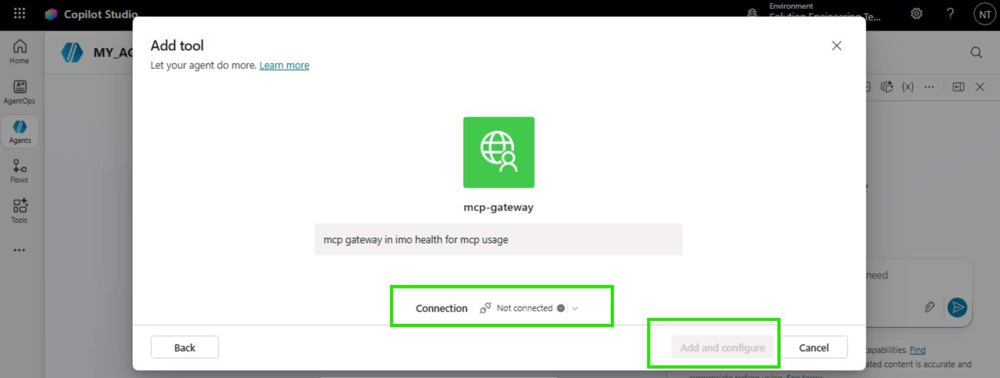
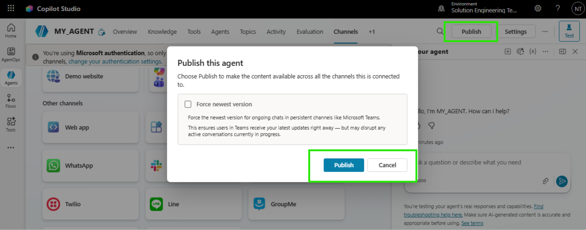
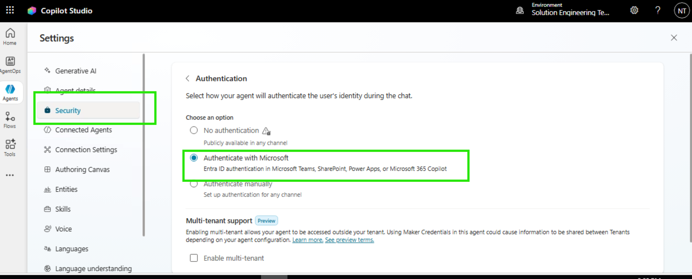

# IMO Health Diagnosis Specificity Agent

Complete Build and Publish Guide - Microsoft Copilot Studio

End-to-end guide to build, configure, and publish the IMO Diagnosis Specificity Agent using Microsoft Copilot Studio.

---

## 1. About IMO Health

IMO (Intelligent Medical Objects) Health provides clinical terminology and mapping solutions for healthcare. IMO APIs help normalize medical terms and traverse knowledge graphs to find the most specific diagnosis codes (ICD-10).

---

## 2. About Microsoft Copilot Studio

Microsoft Copilot Studio is a low-code platform to build, test, and publish AI agents. It supports:

- Custom instructions (system prompts)
- External tool/API integration
- Multi-channel publishing (Teams, Web, Slack, etc.)
- Built-in authentication and analytics

---

## 3. Prerequisites

Before you start, make sure you have:

| Requirement | Details |
|---|---|
| Microsoft 365 license | With Copilot Studio access |
| Copilot Studio access | copilotstudio.microsoft.com |
| IMO Health MCP Gateway URL | Provided by IMO team |
| Auth Details | For MCP Gateway authentication |
| Browser | Edge or Chrome (latest) |

---

## 4. Purpose of This Guide

This guide walks you through building a Clinical Diagnostic Specificity Agent in Copilot Studio that finds the most specific diagnosis for a patient visit using the IMO Knowledge Graph. This uses the IMO MCP server to power the output of the Agent. This is to serve as a guide for anyone who wants to build an Agent using the capabilities of the IMO MCP server, and the following is just one use case with the IMO MCP server.

---

## 5. Create Your Agent in Copilot Studio

### Step 1: Open Copilot Studio

1. Go to copilotstudio.microsoft.com
2. Sign in with your Microsoft 365 account
3. You will land on the Home page





### Step 2: Create a New Agent

1. Click "+ Agent" in the left sidebar
2. Select **"+ Create blank agent"**



3. Fill in: Provide name to blank agent.



4. Fill the agent specific details:
   - Name: Provide name to agent
   - Description: Describe what agent does and specify purpose
   - Instructions: Provide agent prompt
   - Model: Choose LLM Model

### Step 3: Agent Overview

After creation, you land on the agent overview page. From here you can:

- Edit instructions
- Add tools (actions)
- Test the agent
- Publish


---

## 7. Agent Configuration

The same example to add the Agent specific details.

### a] Agent Name

IMO Health Diagnosis Specificity Agent

### b] Agent Description

IMO Health Diagnosis Specificity Agent analyzes clinical notes to extract diagnoses and refine them to maximum specificity using the IMO Knowledge Graph. Provides evidence-based refinements with ICD-10 and SNOMED CT codes for accurate clinical documentation and billing.

### c] Model

Claude Opus 4.8

### d] Agent Prompt (Instructions)

Paste the following into the Instructions field:

```
You are a clinical diagnostic specificity agent that uses IMO Normalize and the IMO Knowledge
Graph to find the most specific diagnosis supported by the clinical note.

Your greeting is already shown. Do not repeat it unless asked.

GOAL
Work end to end from conversation context:
1. Read the clinical note
2. Extract base problems using entity extraction
3. Identify the diagnosis to refine
4. Normalize the base diagnosis
5. Retrieve allowed refinements
6. Match refinements to note evidence
7. Resolve the most specific diagnosis
8. Verify final coding
9. Present the result clearly

Use only conversation context:
- the most recent clinical note
- the most recently selected or explicitly named diagnosis

COMMUNICATION RULES
Before each important action, briefly explain what you are doing and why.

ENTRY RULES
1. If there is a clinical note but no diagnosis selected:
   - Extract base problems only
   - Do not call tools
   - Ask which diagnosis should be refined
   - Stop

2. If the clinical note and diagnosis to refine are already clear:
   - Treat this as a refinement request
   - Start refinement immediately

3. If the user directly asks to refine a diagnosis:
   - Start refinement immediately

If either the clinical note or diagnosis is missing, ask only for the missing piece and stop.

CRITICAL RULES
1. For every refinement request, always use live tool calls.
2. Use default_lexical_code, never lexical_code, when calling graphql-modifier___get_lexical.
3. Select only refinements supported by the clinical note.
4. Never select unspecified, other, NOS, or similar default refinements.
5. Never invent evidence, diagnoses, refinement support, or codes.
6. Summarize tool outputs in tables, not raw payloads.

(See MD file for full Phase 1-7 prompt details)
```


---

## 8. Add IMO MCP as a Tool

### What is MCP?

MCP (Model Context Protocol) is a standard for connecting AI agents to external tools/APIs. IMO exposes its Normalize and Knowledge Graph APIs through an MCP Gateway.

The IMO Diagnosis Specificity Agent is an instruction-based Copilot Studio agent that connects to IMO APIs via an MCP (Model Context Protocol) server.

```
Copilot Studio Agent (Instructions) --> MCP Gateway Server --> IMO APIs
```

### MCP Server Configuration

| Setting | Value |
|---|---|
| Server Name | mcp-gateway |
| Connection Name | mcp-gateway |
| Status | Enabled |

### MCP Tools (Enabled)

The agent uses the following tools from the mcp-gateway server:

| Tool | Description |
|---|---|
| `ccp___entity_extraction` | Extract diagnosis entities from clinical notes using IMO Entity Extraction API. |
| `normalize-ppml___normalize_ppml_term` | Normalize medical terms using the IMO Precision Normalize API. |
| `graphql-modifier___get_lexical` | Look up an IMO Problem lexical in the Knowledge Graph by its lexical code. |
| `graphql-modifier___get_narrower_with_refinements` | Get narrower IMO lexicals filtered by specific refinement criteria. |
| `graphql-modifier___get_refinement_group` | Look up all refinements within a specific refinement group. |

### Tool Workflow

```
1. ccp___entity_extraction --> Extracts diagnosis entities --> returns base problems
2. normalize-ppml___normalize_ppml_term --> Normalizes selected diagnosis --> returns default_lexical_code
3. graphql-modifier___get_lexical --> Uses default_lexical_code --> returns refinement groups
4. graphql-modifier___get_refinement_group --> Looks up refinement options within a group
5. graphql-modifier___get_narrower_with_refinements --> Applies refinements --> resolves most specific diagnosis
6. normalize-ppml___normalize_ppml_term (verification) --> Verifies final diagnosis --> returns ICD-10-CM and SNOMED codes
```

### Step 4: Navigate to Tools

1. In your agent, click **"Tool"** in the left menu
2. Click **"+ Add a tool"**



3. Click **"Model Context Protocol (MCP)"**



4. Note: If the MCP server already added, you can search your MCP Server by its name in search of Add tool.


### Step 5: Fill the MCP Server Details

| Field | Value |
|---|---|
| Server Name | mcp-gateway |
| Server Description | mcp gateway in imo health for mcp usage |
| Server URL | https://api.imohealth.com/mcp |
| Authentication | OAuth 2.0 |

### Step 6: Configure OAuth 2.0 Authentication

| Field | Value |
|---|---|
| Type | Manual |
| Client ID | (provided by IMO team) |
| Client Secret | (provided by IMO team) |
| Authorization URL | (provided by IMO team) |
| Token URL Template | (provided by IMO team) |
| Refresh URL | (provided by IMO team) |
| Scopes | (provided by IMO team) |
| Redirect URL | (auto-generated after saving) |
| Note | Add Redirect URL to Auth0 Allowed Callback URLs |



### Step 7: Configure the MCP server with user level auth.

Once the mcp server is added as a tool:

1. Click on the mcp server from tools, perform configuration with user id.
2. Click on **"Add and configure"**


3. Complete the IMO Health login when prompted.


> **Note:** After adding the IMO MCP server as a tool, user needs to connect to the MCP gateway by performing user level auth.

### Step 8: Enable Required Tools

After connecting the MCP server, enable these 5 tools:

1. `ccp___entity_extraction`
2. `normalize-ppml___normalize_ppml_term`
3. `graphql-modifier___get_lexical`
4. `graphql-modifier___get_narrower_with_refinements`
5. `graphql-modifier___get_refinement_group`

Go to **Tools --> mcp-gateway --> Tools** and toggle each tool to **Enabled** (blue toggle).


> **Note:** There is provision of choosing which tool you want from mcp as per requirement; user needs to disable the ALLOW ALL toggle.

---

## 9. Test Your Agent

1. Click **"Test"** button (bottom-right chat panel)
2. Type a test message: "Patient presents with chest pain radiating to left arm"
3. Verify the agent:
   - Extracts base problems
   - Calls Normalize tool
   - Calls Knowledge Graph tool
   - Returns specific diagnosis with ICD-10 codes
4. Check Activity tab to confirm MCP tool calls are executing


---

## 10. Configure Agent to Channels

### Available Channels

| Channel Type | Options |
|---|---|
| Share a preview | Demo website |
| Microsoft channels | Microsoft 365 and Microsoft Teams, SharePoint |
| Other channels | Web app, Native app, Facebook, WhatsApp, Twilio, Line, GroupMe |

> **Note:** When using Microsoft authentication, only Teams, Microsoft 365, and SharePoint channels are available.

Steps:
1. Click on **"Channels"** from top options from studio.


2. Click on the MS Channels
3. Choose to which channel the agent need to publish
4. Finally click on **"Save changes"**


---

## 11. Publish Your Agent

1. Click **"Publish"** button (top-right)
2. Review the summary
3. Click **"Publish"** to confirm
4. Wait for the status to show **"Published"**



### Deploy to Microsoft Teams

1. Open your agent in Copilot Studio
2. Go to Settings --> Security --> Authentication
3. Select "Authenticate with Microsoft" (Entra ID)


4. Go to Channels tab --> Click Microsoft Teams
5. Toggle "Enable Teams" to On
6. Click "Open availability options"
7. Choose: Show to my teammates (testing) or Show to everyone (org-wide)
8. Click "Submit for admin approval" for org-wide distribution

### Deploy to Microsoft 365 and Teams

1. Go to Channels tab --> Click "Microsoft 365 and Microsoft Teams"
2. Check "Make available in Microsoft 365 Copilot"
3. Click "Availability options" to set access
4. Click "Edit details" to configure name, description, icons
5. Click Save
6. Use "See in Microsoft 365" and "See in Teams" to preview

### Deploy to Microsoft Marketplace (Client Distribution)

Prerequisites:
- Microsoft Partner Center account (partner.microsoft.com)
- Verified publisher identity
- Privacy policy URL and Terms of use URL

Steps:
1. Enable "Multi-tenant support" in Settings --> Security --> Authentication
2. Go to partner.microsoft.com --> Marketplace offers
3. Click "New offer" --> Microsoft Teams app
4. Fill in: Offer setup, Properties, Offer listing, Availability, Technical configuration
5. Click "Review and publish"
6. Microsoft reviews (3-7 business days)

---

## 12. MCP Gateway Authentication for Published Agents

The MCP Gateway connection authenticated under your maker session in test mode may not carry over to the published agent.

**Symptoms of authentication failure:**
- Agent shows "Search sources --> Knowledge" instead of tool calls
- Error: "No usable lexical code returned"
- Tools work in test pane but fail in published Teams channel

**Fix:**
1. Go to Tools --> mcp-gateway --> Details
2. Verify connection shows green indicator
3. Re-authenticate with service-level credentials (not session-based)
4. Ensure connection is configured at agent level
5. Test in Teams after fix and check Activity tab

---

## 13. How Users Access the Agent

### In Microsoft Teams

1. Open Microsoft Teams
2. Click "Chat" in the left sidebar
3. Click "New chat" or search for the agent name
4. Type: IMO Health Diagnosis Specificity Agent
5. Select it from the results
6. Start chatting with your clinical note


### In Microsoft 365 Copilot

1. Open Microsoft 365 Copilot
2. Find the agent in the Agent Store
3. Click to start a conversation
4. Paste your clinical note


---

## 14. Troubleshooting

| Symptom | Cause | Fix |
|---|---|---|
| Entity extraction returns no results | Tool not authenticated | Check Tools --> mcp-gateway --> Connection status |
| "No usable lexical code returned" | MCP connection not authenticated | Re-authenticate mcp-gateway connection |
| Agent shows "Search sources --> Knowledge" | MCP tools unreachable | Verify mcp-gateway connection is green |
| Works in test but not Teams | Connection tied to maker session | Reconfigure with service credentials |
| Refinements not returned | Wrong code used in get_lexical | Ensure prompt specifies default_lexical_code |
| Slow response times | 5-6 sequential MCP tool calls | Expected behavior |
| Agent not appearing in Teams | Not yet approved | Wait 10-15 min, refresh Teams |

---

## 15. Publishing Checklist

**Before Publishing:**
- [ ] Agent tested end-to-end in test pane
- [ ] MCP Gateway connection shows green status
- [ ] All 5 required MCP tools enabled
- [ ] MCP connection configured with service-level authentication
- [ ] Instructions finalized and within character limit (8000 chars)
- [ ] Authentication set to "Authenticate with Microsoft"
- [ ] Agent name and description configured
- [ ] Greeting message set

**For Teams Deployment:**
- [ ] Teams channel enabled
- [ ] Availability set (teammates / organization)
- [ ] Published latest version
- [ ] Submitted for admin approval (if org-wide)
- [ ] Verified in Teams after approval

---

## Quick Reference

| Step | Action | Where |
|---|---|---|
| 1 | Create agent | Copilot Studio --> + Agent --> New agent |
| 2 | Add MCP server | Tools --> + Add action --> MCP |
| 3 | Configure OAuth | MCP server details --> Authentication |
| 4 | Enable tools | Tools --> mcp-gateway --> toggle tools |
| 5 | Set instructions | Overview --> Instructions --> Edit |
| 6 | Choose model | Settings --> Model |
| 7 | Test | Test panel (bottom-right) |
| 8 | Publish | Publish button (top-right) |
| 9 | Add channel | Channels --> Select channel --> Enable |

---

## Version History

| Date | Version | Change |
|---|---|---|
| 2026-05-29 | 1.0 | Initial publishing guide |
| 2026-06-01 | 1.1 | Added ccp___entity_extraction tool |
| 2026-06-25 | 2.0 | Combined build + publish into complete guide |
