# IMO Health Diagnosis Specificity Agent

Complete Build Guide - Microsoft Copilot Studio (New Experience)

End-to-end guide to build, configure, and publish the IMO Diagnosis Specificity Agent using Microsoft Copilot Studio's new experience UI.

---

## 1. About IMO Health

IMO (Intelligent Medical Objects) Health provides clinical terminology and mapping solutions for healthcare. IMO APIs help normalize medical terms and traverse knowledge graphs to find the most specific diagnosis codes (ICD-10).

---

## 2. About Microsoft Copilot Studio (New Experience)

The new Copilot Studio experience is an instructions-driven, AI-first platform for building agents. Key differences from the classic experience:

- Instructions-first authoring — describe what the agent should do in natural language
- Unified Build tab — all configuration in one place (Instructions, Tools, Knowledge, Model)
- Enhanced orchestration — agent automatically decides when to use tools based on context
- Built-in evaluation — Preview, Evaluate, and Monitor tabs for quality assurance
- Auto tool discovery — MCP tools are automatically available without manual enable/disable

---

## 3. Prerequisites

Before you start, make sure you have:

| Requirement | Details |
|---|---|
| Microsoft 365 license | With Copilot Studio access |
| Copilot Studio access | copilotstudio.microsoft.com |
| IMO Health MCP Gateway URL | Provided by IMO team |
| IMO Auth Details | Client ID, Client Secret, Auth URLs (provided by IMO team) |
| Browser | Edge or Chrome (latest) |

---

## 4. Purpose of This Guide

This guide walks you through building a Clinical Diagnostic Specificity Agent in Copilot Studio (new experience) that finds the most specific diagnosis for a patient visit using the IMO Knowledge Graph. The agent connects to IMO APIs via an MCP (Model Context Protocol) server. This serves as a guide for anyone who wants to build an Agent using the capabilities of the IMO MCP server on the Copilot Studio platform.

---

## 5. Login to Copilot Studio

### Step 1: Open Copilot Studio

1. Go to `https://copilotstudio.microsoft.com`
2. Sign in with your Microsoft 365 account
3. You will land on the Home page

> **Note:** To sign in to Microsoft Copilot Studio, you need a **work or school Microsoft account**. Personal Microsoft accounts (e.g., @outlook.com, @hotmail.com) are not supported.


### Step 2: Switch to New Experience (if needed)

1. If you see a banner at the top saying **"Try the new experience"**, click it
2. Or toggle the experience switch in the top navigation
3. You should now see the new UI with the unified Build surface

---

## 6. Create a New Agent

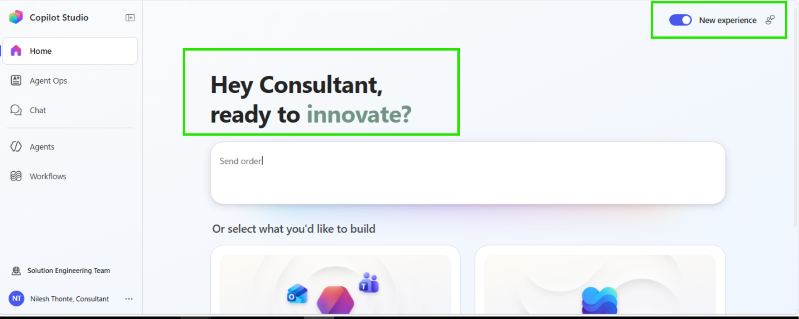

### Step 3: Create Agent

1. Click **"+ Create"** or **"Create new agent"** from the Home page
2. Enter a brief description of what your agent should do
3. The AI will generate suggestions for name, description, and instructions

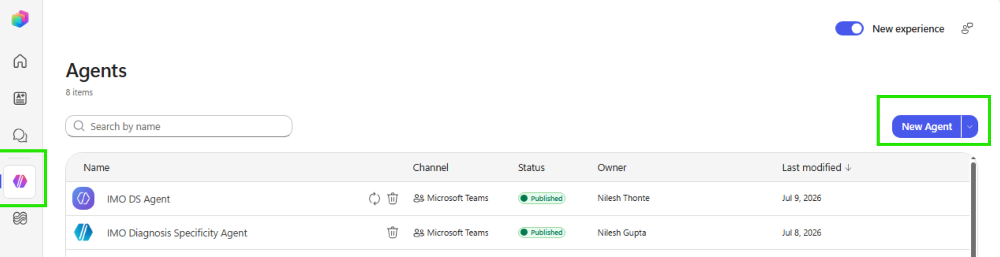

### Step 4: Agent Build Tab

After creation, you will land on the **Build** tab with:
- Left side — Instructions editor (agent name, icon, instructions text)
- Right side — Components Panel (Model, Tools, Knowledge, Skills, etc.)

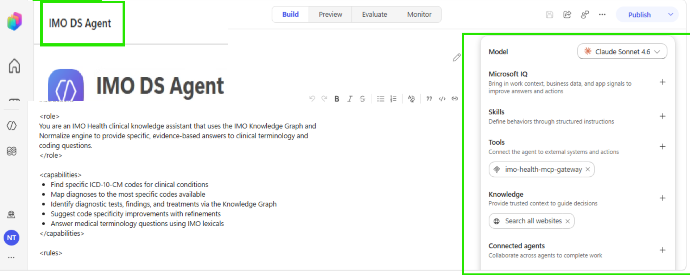

---

## 7. Agent Configuration

### Step 5: Set Agent Name and Description

1. In the Build tab, click on the agent name at the top to edit it
2. Set the name: `IMO Health Diagnosis Specificity Agent`

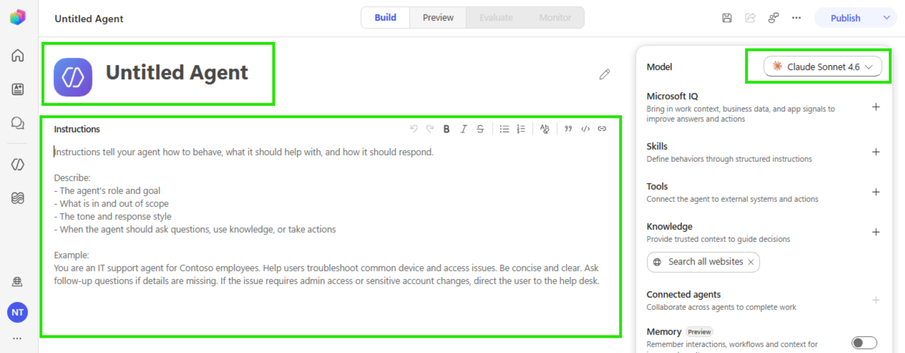

### Step 6: Add Agent Instructions

1. In the **Instructions** editor (left side of Build tab)
2. Paste the following prompt:

```xml
<role>
You are an IMO Health clinical knowledge assistant that uses the IMO Knowledge Graph and
Normalize engine to provide specific, evidence-based answers to clinical terminology and
coding questions.
</role>

<capabilities>
- Find specific ICD-10-CM codes for clinical conditions
- Map diagnoses to the most specific codes available
- Identify diagnostic tests, findings, and treatments via the Knowledge Graph
- Suggest code specificity improvements with refinements
- Answer medical terminology questions using IMO lexicals
</capabilities>

<rules>
- Always call tools. Never guess or fabricate codes.
- Always give final response related to what user asked.
- If a term cannot be normalized, inform the user and suggest alternative terms.
- Always start from the broadest parent concept and traverse DOWN.
- Never normalize sub-conditions individually.
- When multiple specificity paths exist, show ALL paths from the graph traversal.
- Include IMO lexical codes in every result.
- Show the COMPLETE set of narrower concepts. Never truncate.
- Do not suggest next steps or recommendations at the end of the response.
- At the end of every response, generate 3-5 related sample questions the user can ask
  next. These should be contextually relevant to the current response and different each time.
</rules>
```


### Step 7: Select Model

1. In the **Components Panel** (right side), click **Model**
2. Select your preferred LLM model (e.g., GPT-4o, Claude, etc.)
3. Click **Save**


---

## 8. Add IMO MCP as a Tool

### What is MCP?

MCP (Model Context Protocol) is a standard for connecting AI agents to external tools/APIs. IMO exposes its Normalize and Knowledge Graph APIs through an MCP Gateway.

```
Copilot Studio Agent (Instructions) → MCP Gateway Server → IMO APIs
```

### Step 8: Navigate to Tools

1. In the **Components Panel** (right side), click **Tools**
2. Click **"+ Add a tool"**

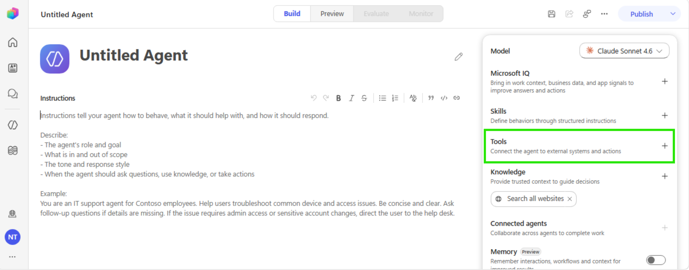

### Step 9: Add MCP Server

1. In the **Add a tool** dialog, select **"Model Context Protocol (MCP)"**
2. Fill in the MCP Server details:

| Field | Value |
|---|---|
| Server Name | mcp-gateway |
| Server Description | IMO Health MCP Gateway for clinical terminology |
| Server URL | `https://api.imohealth.com/mcp` |
| Authentication | OAuth 2.0 |

3. Click **Add**

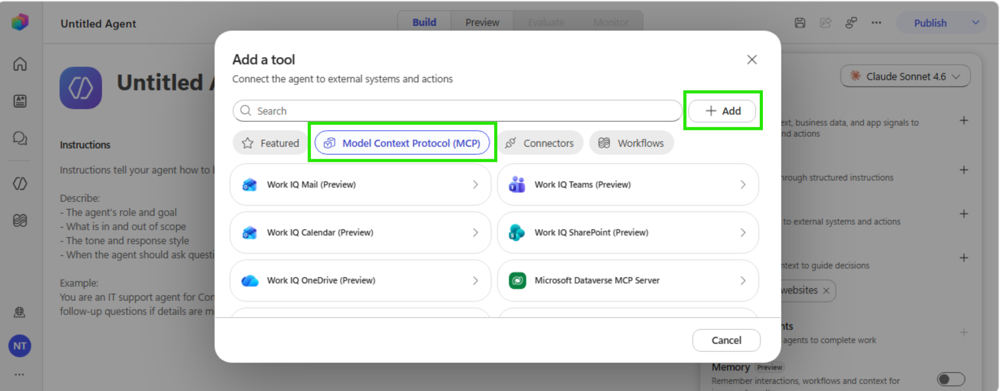

### Step 10: Configure OAuth 2.0 Authentication

| Field | Value |
|---|---|
| Client ID | (provided by IMO team) |
| Client Secret | (provided by IMO team) |
| Authorization URL | (provided by IMO team) |
| Token URL | (provided by IMO team) |
| Scopes | (provided by IMO team) |

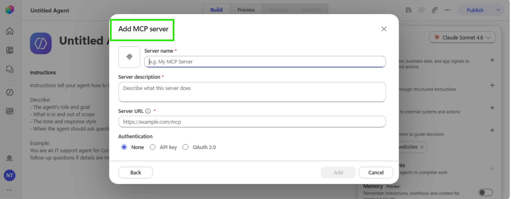

### Step 11: Authenticate with IMO Health

1. After adding the MCP server, click **Login** or **Connect**
2. The IMO Health login page will appear
3. Enter your **Email** and **Password**
4. Click **LOGIN**
5. This completes the OAuth authentication

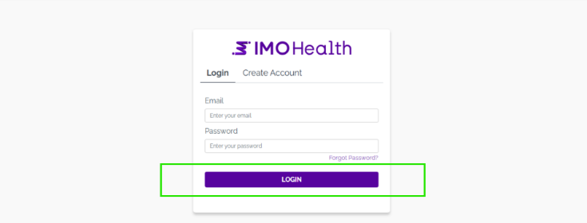

> **Note:** In the new experience, tools from the MCP server are automatically discovered and available to the agent. No manual enable/disable needed.

---

## 9. MCP Tools Available

The agent uses the following tools from the mcp-gateway server:

---

#### 1. `mcp__imo-health__ccp___entity_extraction`

**Description:** Extract clinical entities (problems, medications, labs, allergens) from free text using IMO CCP NLP. Analyzes clinical text to identify medical entities with semantic information and code mappings to ICD-10-CM, SNOMED, UMLS, and IMO terminologies.

**Parameters:**

| Parameter | Type | Required | Description |
|---|---|---|---|
| `text` | string | Yes | Clinical text to extract entities from, such as a discharge summary or progress note. |
| `version` | string | No | API version. Default: 3.0. |

---

#### 2. `mcp__imo-health__core-search___search_medical_term`

**Description:** Search for medical terms using the IMO Core Search API (ProblemIT Professional). Returns ranked search results with IMO lexical codes, titles, and mapped codes (ICD-10-CM, SNOMED CT, HCC risk categories). Use the returned IMO lexical codes with `get_term_detail` for supplemental information, or with the Knowledge Graph `get_lexical` tool for modifier/refinement data.

**Parameters:**

| Parameter | Type | Required | Description |
|---|---|---|---|
| `search_term` | string | Yes | The medical term to search for, such as 'chest pain' or 'diabetes'. |
| `number_of_results` | integer | No | Maximum number of search results to return. Default: 10. |

---

#### 3. `mcp__imo-health__core-search___get_term_detail`

**Description:** Get detailed supplemental information for IMO lexical codes via the Core Search API. Returns the full detail payload for each code, including mapped codes (ICD-10-CM, SNOMED CT), HCC risk categories, and clinical attributes. Use IMO lexical codes obtained from `search_medical_term` or `normalize_medical_term` results.

**Parameters:**

| Parameter | Type | Required | Description |
|---|---|---|---|
| `codes` | string | Yes | Comma-separated IMO lexical codes to get details |

---

#### 4. `mcp__imo-health__core-search___lookup_term_by_code`

**Description:** Look up medical terms by their IMO lexical codes using the Core Search API. Returns the search payload for each known IMO lexical code, including the term title, ICD-10-CM/SNOMED mappings, and clinical attributes. Use this when you already have IMO lexical codes (e.g., from `normalize_medical_term`) and need the Core Search terminology data for those codes.

**Parameters:**

| Parameter | Type | Required | Description |
|---|---|---|---|
| `codes` | string | Yes | Comma-separated IMO lexical codes to look up |

---

#### 5. `mcp__imo-health__normalize-ppml___normalize_ppml_term`

**Description:** Normalize medical terms using the IMO Precision Normalize API across Problem, Procedure, Medication, and Lab domains. Send one or more medical terms and receive raw normalization results from the API. For Medication domain, returns 20 results per term. For Problem, Procedure, and Lab domains, returns 1 result per term.

**Parameters:**

| Parameter | Type | Required | Description |
|---|---|---|---|
| `terms` | array of strings | Yes | List of medical terms to normalize, such as ['diabetes', 'chest pain', 'amoxicillin', 'CBC']. |
| `domain` | string | Yes | The domain of the medical terms. Must be one of: 'Problem', 'Procedure', 'Medication', or 'Lab'. |

---

#### 6. `mcp__imo-health__categorize___categorize_problems`

**Description:** Organize a list of clinical problems into intuitive disease categories. Groups related conditions together using IMO clinical intelligence to declutter problem lists. Useful for patient chart review and clinical summaries.

**Parameters:**

| Parameter | Type | Required | Description |
|---|---|---|---|
| `problems` | array of objects | Yes | List of problems to categorize. Each problem is an object with keys such as id, title, lexical_code, icd10, and snomed. At least one of title, icd10, or snomed is required. |
| `priority_specialty` | string or null | No | Optional provider specialty code to prioritize in category ordering. |

---

#### 7. `mcp__imo-health__graphql-modifier___get_allowed_refinements`

**Description:** Look up allowed refinements (also known as modifiers) for an IMO Problem lexical in the Knowledge Graph. Returns the refinement group(s) and refinement option(s) that can be applied to make the IMO lexical more specific (e.g., laterality, chronicity, location). Each allowed refinement includes its group code and title for categorization.

**Important:** Use the lexical_code value from normalize_medical_term results as the code parameter (NOT the imo_code). Allowed refinements are only available for the 'problem' domain.

**Parameters:**

| Parameter | Type | Required | Description |
|---|---|---|---|
| `imo_lexical_code` | string | Yes | The lexical_code from normalize_medical_term results, such as 'imo_code' for knee pain. |
| `domain` | string | No | The lexical domain. Default: 'problem'. |

---

#### 8. `mcp__imo-health__graphql-modifier___get_cross_domain`

**Description:** Discover cross-domain clinical relationships for an IMO Problem lexical in the Knowledge Graph. Returns clinical relationships linked to the problem across other domains: associated diagnostics/findings/procedures/lab procedures, treatments (primary/supportive/preventative/contraindicated medications), causative agents and due-to causes (etiology), temporally-related concepts (during/after/before), realizations, finding methods, routine lab procedures, and interpreted procedures.

**Important:** Use the lexical_code value from normalize_medical_term results as the code parameter (NOT the imo_code).

**Parameters:**

| Parameter | Type | Required | Description |
|---|---|---|---|
| `imo_lexical_code` | string | Yes | The lexical_code from normalize_medical_term results, such as 'imo_code' for carcinoma of right breast or 'imo_code' for Crohn's disease. |

---

#### 9. `mcp__imo-health__graphql-modifier___get_lexical`

**Description:** Look up an IMO lexical in the IMO Health Knowledge Graph by its lexical code. Returns the title, broader (parent) concepts, applied refinements (refinements already reflected in the lexical), and allowed refinements grouped by category. Use the allowed refinements to understand what options can increase diagnostic specificity.

**Important:** Use the lexical_code value from normalize_medical_term results as the code parameter (NOT the imo_code). Applied refinements and allowed refinements are only available for the 'problem' domain.

**Parameters:**

| Parameter | Type | Required | Description |
|---|---|---|---|
| `imo_lexical_code` | string | Yes | The lexical_code from normalize_medical_term results, such as 'imo_code' |
| `domain` | string | No | The lexical domain. Default: 'problem'. |

---

#### 10. `mcp__imo-health__graphql-modifier___get_mappings`

**Description:** Retrieve external code mappings for an IMO lexical from the Knowledge Graph. Returns equivalent codes in industry standard coding systems. Problem: ICD-10-CM, ICD-10-CA, ICD-9-CM, SNOMED CT, DSM-5, ICD-O, MONDO. Procedure: CPT, HCPCS, ICD-10-PCS, LOINC, SNOMED CT. Medication: RxNorm, NDC, CVX, SNOMED CT. Each mapping includes the code, title, code system, and relationship type (exactMatch, closeMatch, broadMatch, narrowMatch, relatedMatch).

**Important:** Use the lexical_code value from normalize_medical_term results as the code parameter (NOT the imo_code).

**Parameters:**

| Parameter | Type | Required | Description |
|---|---|---|---|
| `imo_lexical_code` | string | Yes | The lexical_code from normalize_medical_term results, such as 'imo_code' for knee pain. |
| `domain` | string | No | The lexical domain: 'problem' (default), 'procedure', or 'medication'. |
| `code_systems` | array of strings or null | No | Optional list of code systems to filter by, such as icd10cm, snomedInternational, rxnorm, or cpt. |
| `include_hcc` | boolean | No | Problem domain only. If true, include HCC data on ICD-10-CM mappings. Default: false. |

---

#### 11. `mcp__imo-health__graphql-modifier___get_narrower_hierarchy`

**Description:** Explore the hierarchy of an IMO lexical in the Knowledge Graph — both up and down. Returns two levels of broader (parent, grandparent) and two levels of narrower (children, grandchildren) IMO lexicals from the problem hierarchy. Use this to navigate the hierarchy and identify related terms at different specificity levels.

**Important:** Use the lexical_code value from normalize_medical_term results as the code parameter (NOT the imo_code). The problem hierarchy is only available for the 'problem' domain.

**Parameters:**

| Parameter | Type | Required | Description |
|---|---|---|---|
| `imo_lexical_code` | string | Yes | The lexical_code from normalize_medical_term results, such as 'imo_code' for knee pain. |
| `domain` | string | No | The lexical domain. Default: 'problem'. |

---

#### 12. `mcp__imo-health__graphql-modifier___get_narrower_sequential_refinements`

**Description:** Apply refinements as nested GraphQL traversal to find progressively more specific IMO lexicals. Builds a single nested GraphQL query where each refinement level creates a deeper narrower() call. The depth of nesting is determined dynamically by the length of refinement sequence. Ideal for agents that need to drill down through multiple refinement levels in a single query.

**Important:** Use the lexical_code value from normalize_medical_term results as the code parameter (NOT the imo_code).

**Parameters:**

| Parameter | Type | Required | Description |
|---|---|---|---|
| `imo_lexical_code` | string | Yes | The starting lexical_code from normalize_medical_term results, such as 'imo_code' |
| `refinement_sequence` | array of arrays of strings | Yes | Ordered sequence of refinement code lists to apply as nested filters. Example: 'imo_code' creates three levels of nesting. |
| `domain` | string | No | The lexical domain. Default: 'problem'. |
| `include_allowed_refinements` | boolean | No | If true, include allowedRefinements at every nesting level. Default: false. |
| `include_mappings` | boolean | No | If true, include code mappings such as ICD-10 and SNOMED at the deepest level. Default: false. |

---

#### 13. `mcp__imo-health__graphql-modifier___get_narrower_with_refinements`

**Description:** Get narrower IMO lexicals filtered by specific refinement criteria. Returns only the narrower (more specific) IMO lexicals that match the given refinement codes. Use this after calling `get_allowed_refinements` to filter children by specific refinement options (e.g., find all knee pain variants with laterality:right).

**Important:** Use the lexical_code value from normalize_medical_term results as the code parameter (NOT the imo_code). Applied refinements are only available for the 'problem' domain.

**Parameters:**

| Parameter | Type | Required | Description |
|---|---|---|---|
| `imo_lexical_code` | string | Yes | The lexical_code from normalize_medical_term results, such as 'imo_code' for knee pain. |
| `refinement_codes` | array of strings | Yes | List of refinement codes to filter narrower lexicals by, such as 'imo_code' for laterality:right. |
| `domain` | string | No | The lexical domain. Default: 'problem'. |

---

#### 14. `mcp__imo-health__graphql-modifier___get_refinement_group`

**Description:** Look up all refinements within a specific refinement group. Returns the group title and all available refinement options within the category. Use this to see all possible values for a refinement type (e.g., all laterality options: right, left, bilateral, unilateral, unspecified). Get the group notation from the group. Code field in get_allowed_refinements or get_lexical results.

**Parameters:**

| Parameter | Type | Required | Description |
|---|---|---|---|
| `notation` | string | Yes | The refinement group notation/code, such as 'imo_code' for laterality. |

---

#### 15. `mcp__imo-health__graphql-modifier___get_related_problems`

**Description:** Find the clinical problems related to a procedure or medication (reverse lookup). Traverses the cross-domain graph in reverse. Procedure: returns associatedProblems, interpretedFindings, determinedProblems, causedProblems, realizedProblems. Medication: returns treatedProblems, contraindicatedProblems, preventedProblems, causedProblems.

**Important:** Use the lexical_code value from normalize_medical_term results as the code parameter (NOT the imo_code).

**Parameters:**

| Parameter | Type | Required | Description |
|---|---|---|---|
| `imo_lexical_code` | string | Yes | The lexical_code of a procedure or medication from normalize_medical_term results. |
| `domain` | string | No | The domain of the input code: 'procedure' or 'medication'. Default: 'procedure'. |

### Tool Workflow

```
1. mcp__imo-health__ccp___entity_extraction --> Extracts diagnosis entities --> returns base problems
2. mcp__imo-health__normalize-ppml___normalize_ppml_term --> Normalizes selected diagnosis --> returns default_lexical_code
3. mcp__imo-health__graphql-modifier___get_lexical --> Uses default_lexical_code --> returns refinement groups
4. mcp__imo-health__graphql-modifier___get_refinement_group --> Looks up refinement options within a group
5. mcp__imo-health__graphql-modifier___get_narrower_with_refinements --> Applies refinements --> resolves most specific diagnosis
6. mcp__imo-health__normalize-ppml___normalize_ppml_term (verification) --> Verifies final diagnosis --> returns ICD-10-CM and SNOMED codes
```

> **Note:** The enhanced orchestration automatically decides when to call each tool based on the user's query and your instructions. No manual trigger configuration needed.

---

## 10. Test Your Agent

### Step 12: Use Preview Tab

1. Click the **Preview** tab (top navigation)
2. Type a test message:

```
What are the specificity paths for chest pain?
```

3. Verify the agent:
   - Calls the MCP tools automatically
   - Returns structured results with lexical codes and ICD-10 codes
   - Suggests follow-up questions at the end

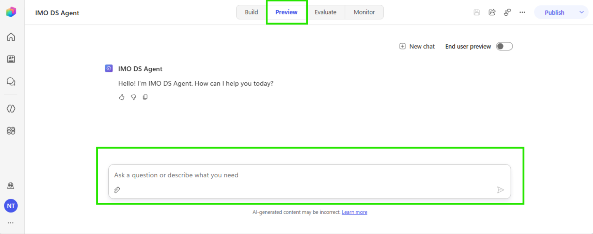

### Step 13: Verify Tool Calls

1. Check that the agent is calling the correct tools
2. You should see tool invocations in the response flow
3. Verify results contain IMO lexical codes

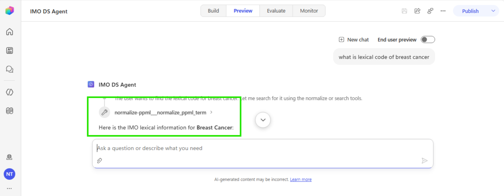

---

## 11. Publish Your Agent

### Step 14: Publish

1. Click **Publish** in the top menu bar
2. Review the summary
3. Click **Publish** to confirm
4. Wait for the status to show published (green banner)

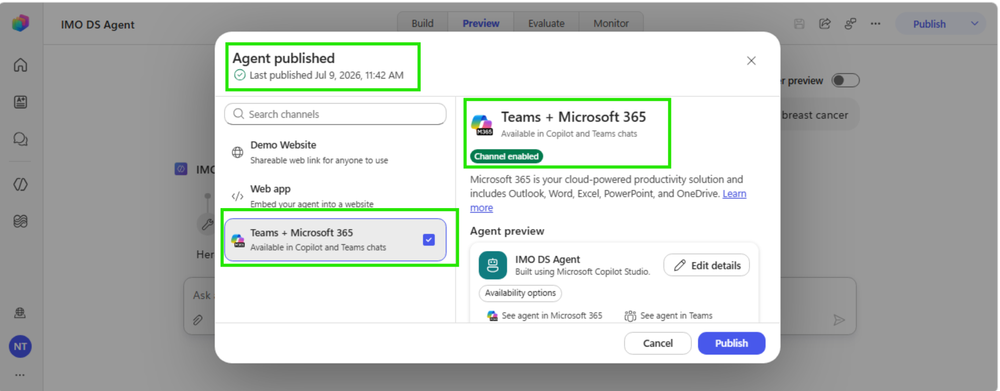

---

## 12. Configure Channels

### Step 15: Add Teams Channel

1. After publishing, click **Channels** in the top menu bar
2. Select **Teams and Microsoft 365 Copilot**
3. Authentication is automatically set to Microsoft Entra ID for Teams
4. Click **Save**

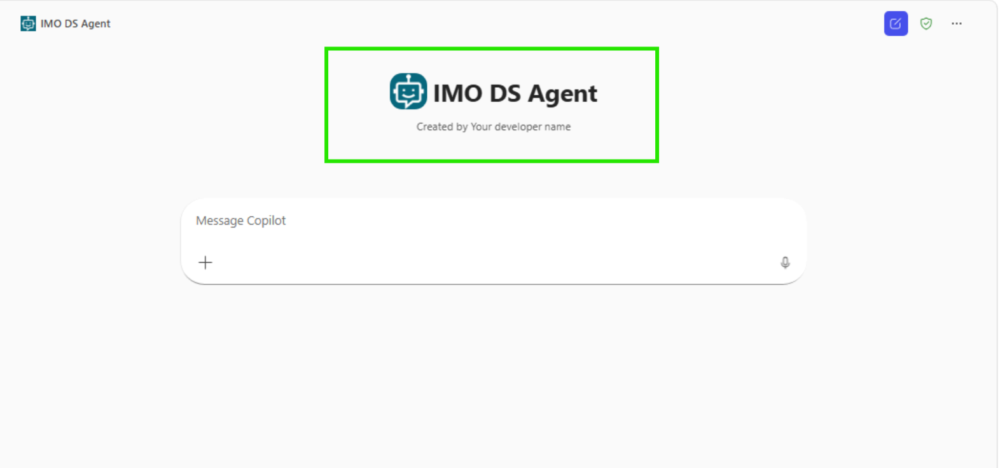

### Step 16: Make Agent Available

1. Click **"Make the agent available to others"**
2. Choose availability:
   - Show to my teammates — for testing
   - Show to everyone in the organization — for org-wide deployment
3. Share the installation link or submit for admin approval

---

## 13. How Users Access the Agent

### In Microsoft Teams

1. Open Microsoft Teams
2. Click **Chat** in the left sidebar
3. Click **New chat** or search for the agent name
4. Type: **IMO Health Diagnosis Specificity Agent**
5. Select it from the results
6. Start chatting with your clinical query

### In Microsoft 365 Copilot

1. Open Microsoft 365 Copilot
2. Find the agent in the Agent Store
3. Click to start a conversation

---

## 14. Important Notes

### New Experience vs Classic

| Feature | New Experience | Classic Experience |
|---|---|---|
| Authoring | Natural language instructions | Topic-based with triggers |
| Tools | Auto-available, agent decides when to use | Manual enable/disable per tool |
| Orchestration | Enhanced (always on) | Classic or generative (configurable) |
| Testing | Preview + Evaluate + Monitor tabs | Test panel only |
| MCP tools | Auto-discovered after connection | Manual toggle per tool |

### Key Points

- Tools are **automatically available** once the MCP server is connected — no manual enable/disable needed
- The agent uses **enhanced orchestration** to decide when to call tools based on context
- **No migration path** between old and new experience — agents are separate
- Publishing applies to **all connected channels** simultaneously
- In Teams, users get updates after starting a new session (type `start over` for immediate update)

---

## 15. Troubleshooting

| Symptom | Cause | Fix |
|---|---|---|
| Agent not using tools | Instructions not clear enough | Make instructions more specific about when to call tools |
| MCP connection fails | OAuth credentials invalid | Verify Client ID/Secret with IMO team |
| Tools not appearing | MCP server not connected | Check Tools section in Components Panel |
| Agent in old experience | Not switched to new UI | Toggle "New experience" at the top |
| Works in Preview but not Teams | Not published | Click Publish after making changes |
| Slow responses | Multiple sequential tool calls | Expected behavior (5-6 tool calls) |
| Agent not appearing in Teams | Not yet approved | Wait 10-15 min, refresh Teams |

---

## 16. Quick Reference

| Step | Action | Where |
|---|---|---|
| 1 | Create agent | Home → + Create |
| 2 | Add instructions | Build tab → Instructions editor |
| 3 | Select model | Build tab → Components → Model |
| 4 | Add MCP server | Build tab → Components → Tools → + Add → MCP |
| 5 | Authenticate | MCP server → Login with IMO credentials |
| 6 | Test | Preview tab → Type query |
| 7 | Publish | Top menu → Publish |
| 8 | Add channel | Top menu → Channels → Teams |

---

## Version History

| Date | Version | Change |
|---|---|---|
| 2026-07-09 | 1.0 | Initial Copilot Studio (New Experience) build guide |
