# IMO Health Diagnosis Specificity Agent

Complete Build Guide - Databricks AI Agent

End-to-end guide to build, configure, and deploy the IMO Diagnosis Specificity Agent using Databricks Supervisor Agent with MCP tools.

---

## 1. About IMO Health

IMO (Intelligent Medical Objects) Health provides clinical terminology and mapping solutions for healthcare. IMO APIs help normalize medical terms and traverse knowledge graphs to find the most specific diagnosis codes (ICD-10).

---

## 2. About Databricks AI Agents

Databricks AI Agent Framework allows you to build, test, and deploy AI agents with access to external tools and data. It supports:

- Multiple LLM models (Claude, Llama, GPT, etc.)
- MCP (Model Context Protocol) tool integration via Unity Catalog
- Supervisor Agent for multi-tool orchestration
- Built-in serving endpoints for production deployment
- AI Playground for testing and validation

---

## 3. Prerequisites

Before you start, make sure you have:

| Requirement | Details |
|---|---|
| Databricks workspace | With Unity Catalog enabled |
| Workspace access | Login credentials for your Databricks instance |
| IMO Health MCP Gateway URL | Provided by IMO team (e.g., `https://api.imohealth.com/mcp`) |
| IMO Auth Details | Client ID, Client Secret, Auth URLs (provided by IMO team) |
| Unity AI Gateway | Beta enabled on your workspace |
| Browser | Edge or Chrome (latest) |

---

## 4. Purpose of This Guide

This guide walks you through building a Clinical Diagnostic Specificity Agent in Databricks that finds the most specific diagnosis for a patient visit using the IMO Knowledge Graph. The agent connects to IMO APIs via an MCP (Model Context Protocol) server registered as a Unity Catalog connection. This serves as a guide for anyone who wants to build an Agent using the capabilities of the IMO MCP server on the Databricks platform.

---

## 5. Login to Databricks Workspace

### Step 1: Search for Databricks Account Console

1. Open your browser (Edge or Chrome)
2. Search for **"databricks account console"** in Bing/Google
3. Click on **"Databricks - Sign In"** link (`https://accounts.cloud.databricks.com`)

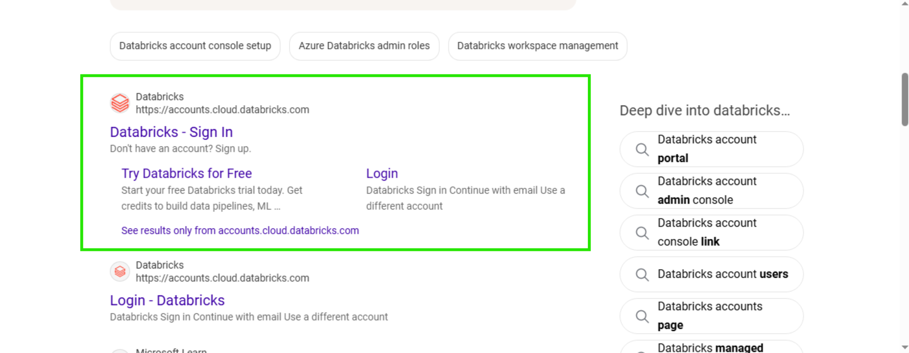

### Step 2: Log In with Email

1. The Databricks **Log in** page will appear
2. Enter your **Email** (the email registered during account creation)
3. Click **Continue**

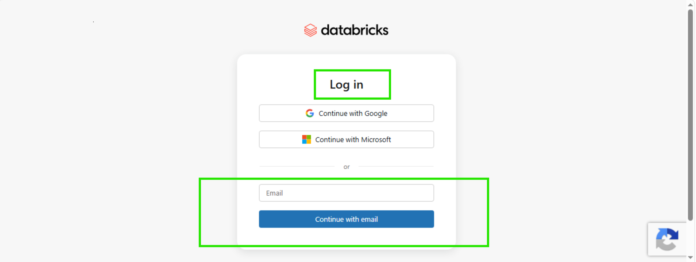

### Step 3: Enter Verification Code

1. Databricks will send a **verification code** to your registered email
2. Check your email inbox for the 6-digit code
3. Enter the verification code in the input boxes
4. You will be logged in after successful verification

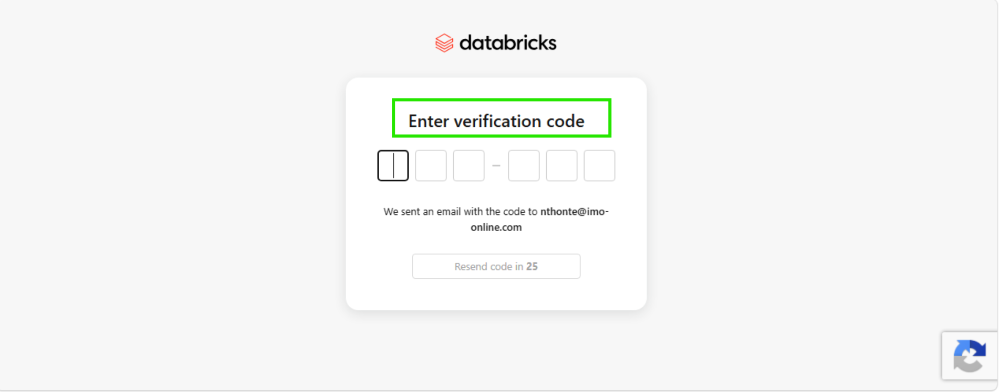

> **Note:** The verification code is sent to the email registered during Databricks account creation.

### Step 4: Verify You Are in the Correct Workspace

1. After login, you will land on the **"Welcome to Databricks"** Home page
2. Check the top-right corner shows **Production** (or your workspace name)
3. You should see the left sidebar with: Workspace, Recents, Catalog, Jobs & Pipelines, Compute, Discover, Marketplace, etc.

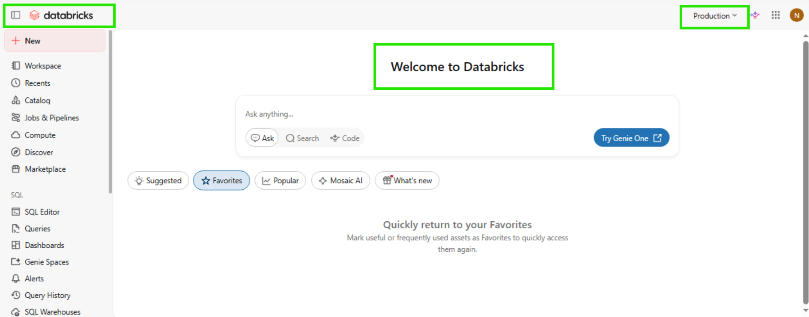

---

## 6. Find the IMO MCP Connection in Unity Catalog

> **Note:** The MCP connection (`imo-health-mcp-gateway`) is already created in Databricks.

### Step 1: Navigate to Catalog

1. Click **Catalog** in the left sidebar
2. Click the **Connect** button (top-right of Catalog page)

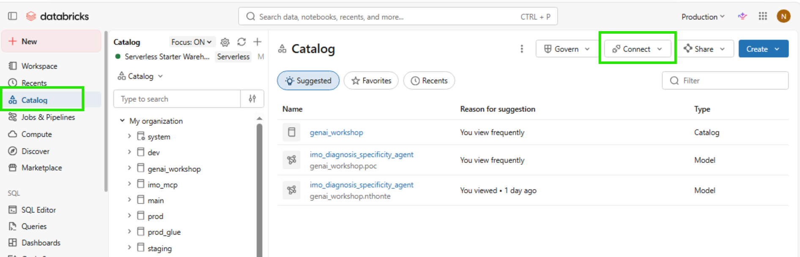

### Step 2: Open Connections

1. From the **Connect** dropdown, click **Connections** (Access external systems)

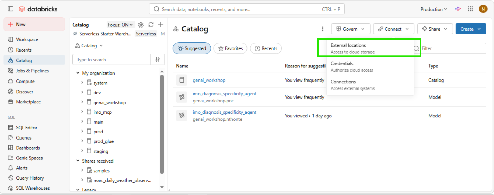

### Step 3: Find the MCP Connection

1. You will see the **External Data** page with the **Connections** tab
2. Find **imo-health-mcp-gateway** in the connections list
3. Click on it to open the connection details

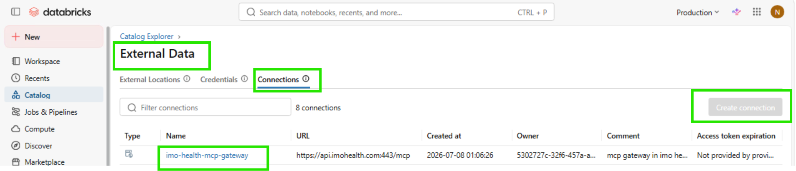

### Step 4: Verify Connection Details

You will see the connection detail page showing:

| Field | Value |
|---|---|
| Connection name | `imo-health-mcp-gateway` |
| Description | mcp gateway in imo health for mcp usage |
| Connection type | HTTP |
| URL | `https://api.imohealth.com:443/mcp` |

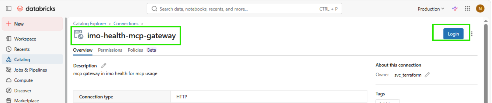

### Step 5: Login and Authenticate

1. Click the **Login** button (top-right, blue button)
2. The IMO Health login page will appear
3. Enter your **Email** and **Password**
4. Click **LOGIN**
5. This completes the OAuth authentication with IMO Health

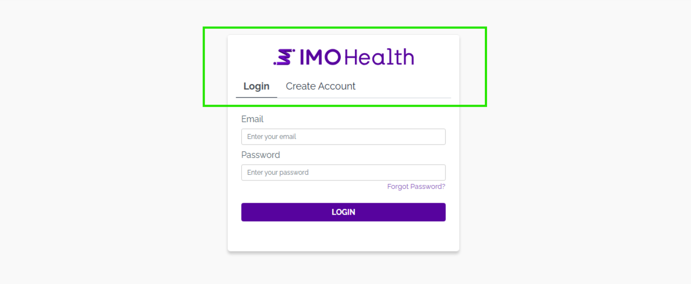

> **Note:** Each user must perform this login once to authenticate their session with the IMO MCP Gateway.

---

## 7. Install MCP from Databricks Marketplace (Recommended)

The IMO Health MCP server is available on the Databricks Marketplace. This is the easiest way to add it as a tool for the AI Playground and Supervisor Agent.

### Step 6: Open Databricks Marketplace

1. Click **Marketplace** in the left sidebar
2. You will see the **Databricks Marketplace** page with "Production apps. Deployed to your data."
3. In the **"Search for products"** bar, type **"IMO"** or **"IMO Health"**

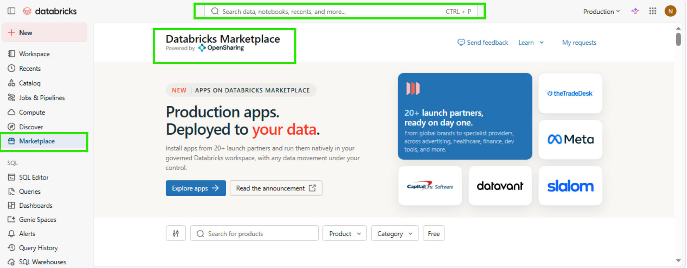

### Step 7: Install the MCP Server

1. Click on the **IMO Health MCP Server** listing from search results
2. You will see the MCP server detail page with Overview, Tools, and Details
3. Click **Install** button (top-right)
4. The **"Install IMO Health MCP Server"** dialog will appear

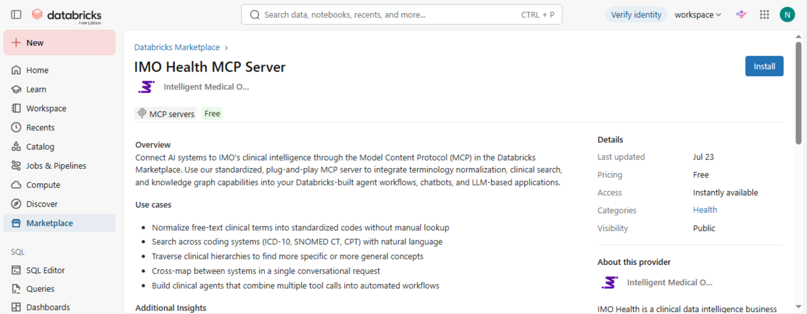

### Step 8: Fill in Installation Credentials

Fill in the following fields in the installation dialog:

| Field | Value |
|---|---|
| Connection name | Enter a name for this connection (e.g., `imo-health-mcp-gateway`) |
| Host | `https://api.imohealth.com` |
| Base path | `/mcp` |
| Client ID | Your IMO Health Consumer Key |
| Client secret | Your IMO Health Consumer Secret |
| Credential type | `OAuth U2M` |
| Port | `443` |
| Authorization endpoint | |
| OAuth scope | |
| Token endpoint | |

Click **Install** to confirm.

> **Note:** Get your Client ID and Client Secret from the [IMO Health Developer Portal](https://developer.imohealth.com) under **My Credentials** → your trial app → **View**.

### Step 9: Configure the Redirect URL

After installation, you need to configure the OAuth redirect URL for the token exchange to work:

1. Navigate to the installed MCP connection in **Catalog → Connections**
2. Click the **three-dot menu (⋮)** on the top-right of the connection page
3. Select **"Manage access request destinations"**

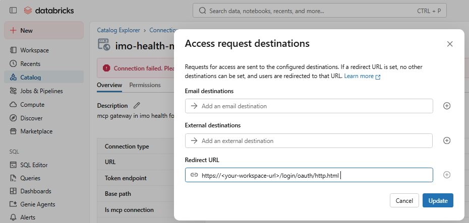

4. In the **"Access request destinations"** dialog, add your Databricks workspace OAuth callback under **Redirect URL**
5. Click **Update**

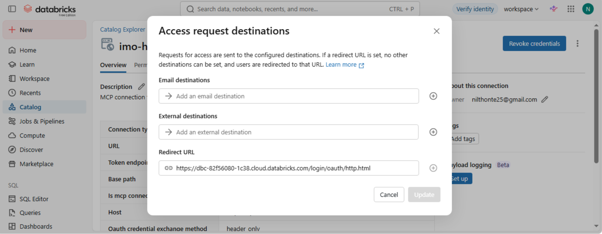

The redirect URL should be set to your Databricks workspace OAuth callback:


```
https://<your-workspace-url>/login/oauth/http.html
```

For example: `https://<your-workspace-url>/login/oauth/http.html`

> **Tip:** You can find this URL in your browser's URL bar as the `redirect_uri` parameter during the OAuth flow.

**If you have an existing email destination configured:**
- Click the trash icon next to the email destination to delete it — Databricks won't allow a redirect URL alongside other destination types
- Then add the redirect URL
- Click **Update**

### Step 10: Authenticate After Installation

1. After installation, navigate to the installed MCP service in your catalog
2. Click **Login** to authenticate with IMO Health
3. Complete the OAuth login (Email + Password)
4. After sign-in, the discovered tools will appear

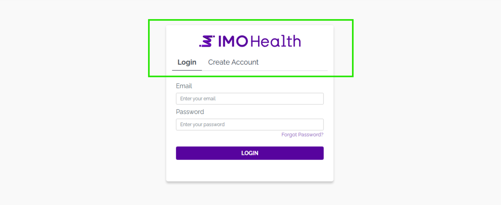

> **Note:** After Marketplace installation, the MCP service is ready to use in AI Playground and Supervisor Agent. You can skip Section 8 (manual creation) and proceed to Section 9.
---

## 9. MCP Tools Available

After connecting, these tools are available from the MCP Gateway:

---

#### 1. `mcp__imo-health__ccp___entity_extraction`

**Description:** Extract clinical entities (problems, medications, labs, allergens) from free text using IMO CCP NLP. Analyzes clinical text to identify medical entities with semantic information and code mappings to ICD-10-CM, SNOMED, UMLS, and IMO terminologies.

**Parameters:**

| Parameter | Type | Required | Description |
|---|---|---|---|
| `text` | string | Yes | Clinical text to extract entities from, such as a discharge summary or progress note. |
| `version` | string | No | API version. Default: 3.0. |

---

#### 2. `mcp__imo-health__core-search___search_medical_term`

**Description:** Search for medical terms using the IMO Core Search API (ProblemIT Professional). Returns ranked search results with IMO lexical codes, titles, and mapped codes (ICD-10-CM, SNOMED CT, HCC risk categories). Use the returned IMO lexical codes with get_term_detail for supplemental information, or with the Knowledge Graph get_lexical tool for modifier/refinement data.

**Parameters:**

| Parameter | Type | Required | Description |
|---|---|---|---|
| `search_term` | string | Yes | The medical term to search for, such as 'chest pain' or 'diabetes'. |
| `number_of_results` | integer | No | Maximum number of search results to return. Default: 10. |

---

#### 3. `mcp__imo-health__core-search___get_term_detail`

**Description:** Get detailed supplemental information for IMO lexical codes via the Core Search API. Returns the full detail payload for each code, including mapped codes (ICD-10-CM, SNOMED CT), HCC risk categories, and clinical attributes. Use IMO lexical codes obtained from search_medical_term or normalize_medical_term results.

**Parameters:**

| Parameter | Type | Required | Description |
|---|---|---|---|
| `codes` | string | Yes | Comma-separated IMO lexical codes to get details |

---

#### 4. `mcp__imo-health__core-search___lookup_term_by_code`

**Description:** Look up medical terms by their IMO lexical codes using the Core Search API. Returns the search payload for each known IMO lexical code, including the term title, ICD-10-CM/SNOMED mappings, and clinical attributes. Use this when you already have IMO lexical codes (e.g., from normalize_medical_term) and need the Core Search terminology data for those codes.

**Parameters:**

| Parameter | Type | Required | Description |
|---|---|---|---|
| `codes` | string | Yes | Comma-separated IMO lexical codes to look up |

---

#### 5. `mcp__imo-health__normalize-ppml___normalize_ppml_term`

**Description:** Normalize medical terms using the IMO Precision Normalize API across Problem, Procedure, Medication, and Lab domains. Send one or more medical terms and receive raw normalization results from the API. For Medication domain, returns 20 results per term. For Problem, Procedure, and Lab domains, returns 1 result per term.

**Parameters:**

| Parameter | Type | Required | Description |
|---|---|---|---|
| `terms` | array of strings | Yes | List of medical terms to normalize, such as ['diabetes', 'chest pain', 'amoxicillin', 'CBC']. |
| `domain` | string | Yes | The domain of the medical terms. Must be one of: 'Problem', 'Procedure', 'Medication', or 'Lab'. |

---

#### 6. `mcp__imo-health__categorize___categorize_problems`

**Description:** Organize a list of clinical problems into intuitive disease categories. Groups related conditions together using IMO clinical intelligence to declutter problem lists. Useful for patient chart review and clinical summaries.

**Parameters:**

| Parameter | Type | Required | Description |
|---|---|---|---|
| `problems` | array of objects | Yes | List of problems to categorize. Each problem is an object with keys such as id, title, lexical_code, icd10, and snomed. At least one of title, icd10, or snomed is required. |
| `priority_specialty` | string or null | No | Optional provider specialty code to prioritize in category ordering. |

---

#### 7. `mcp__imo-health__graphql-modifier___get_allowed_refinements`

**Description:** Look up allowed refinements (also known as modifiers) for an IMO Problem lexical in the Knowledge Graph. Returns the refinement group(s) and refinement option(s) that can be applied to make the IMO lexical more specific (e.g., laterality, chronicity, location). Each allowed refinement includes its group code and title for categorization.

**Important:** Use the lexical_code value from normalize_medical_term results as the code parameter (NOT the imo_code). Allowed refinements are only available for the 'problem' domain.

**Parameters:**

| Parameter | Type | Required | Description |
|---|---|---|---|
| `imo_lexical_code` | string | Yes | The lexical_code from normalize_medical_term results, such as 'imo_code' for knee pain. |
| `domain` | string | No | The lexical domain. Default: 'problem'. |

---

#### 8. `mcp__imo-health__graphql-modifier___get_cross_domain`

**Description:** Discover cross-domain clinical relationships for an IMO Problem lexical in the Knowledge Graph. Returns clinical relationships linked to the problem across other domains: associated diagnostics/findings/procedures/lab procedures, treatments (primary/supportive/preventative/contraindicated medications), causative agents and due-to causes (etiology), temporally-related concepts (during/after/before), realizations, finding methods, routine lab procedures, and interpreted procedures.

**Important:** Use the lexical_code value from normalize_medical_term results as the code parameter (NOT the imo_code).

**Parameters:**

| Parameter | Type | Required | Description |
|---|---|---|---|
| `imo_lexical_code` | string | Yes | The lexical_code from normalize_medical_term results, such as 'imo_code' for carcinoma of right breast or 'imo_code' for Crohn's disease. |

---

#### 9. `mcp__imo-health__graphql-modifier___get_lexical`

**Description:** Look up an IMO lexical in the IMO Health Knowledge Graph by its lexical code. Returns the title, broader (parent) concepts, applied refinements (refinements already reflected in the lexical), and allowed refinements grouped by category. Use the allowed refinements to understand what options can increase diagnostic specificity.

**Important:** Use the lexical_code value from normalize_medical_term results as the code parameter (NOT the imo_code). Applied refinements and allowed refinements are only available for the 'problem' domain.

**Parameters:**

| Parameter | Type | Required | Description |
|---|---|---|---|
| `imo_lexical_code` | string | Yes | The lexical_code from normalize_medical_term results, such as 'imo_code' |
| `domain` | string | No | The lexical domain. Default: 'problem'. |

---

#### 10. `mcp__imo-health__graphql-modifier___get_mappings`

**Description:** Retrieve external code mappings for an IMO lexical from the Knowledge Graph. Returns equivalent codes in industry standard coding systems. Problem: ICD-10-CM, ICD-10-CA, ICD-9-CM, SNOMED CT, DSM-5, ICD-O, MONDO. Procedure: CPT, HCPCS, ICD-10-PCS, LOINC, SNOMED CT. Medication: RxNorm, NDC, CVX, SNOMED CT. Each mapping includes the code, title, code system, and relationship type (exactMatch, closeMatch, broadMatch, narrowMatch, relatedMatch).

**Important:** Use the lexical_code value from normalize_medical_term results as the code parameter (NOT the imo_code).

**Parameters:**

| Parameter | Type | Required | Description |
|---|---|---|---|
| `imo_lexical_code` | string | Yes | The lexical_code from normalize_medical_term results, such as 'imo_code' for knee pain. |
| `domain` | string | No | The lexical domain: 'problem' (default), 'procedure', or 'medication'. |
| `code_systems` | array of strings or null | No | Optional list of code systems to filter by, such as icd10cm, snomedInternational, rxnorm, or cpt. |
| `include_hcc` | boolean | No | Problem domain only. If true, include HCC data on ICD-10-CM mappings. Default: false. |

---

#### 11. `mcp__imo-health__graphql-modifier___get_narrower_hierarchy`

**Description:** Explore the hierarchy of an IMO lexical in the Knowledge Graph — both up and down. Returns two levels of broader (parent, grandparent) and two levels of narrower (children, grandchildren) IMO lexicals from the problem hierarchy. Use this to navigate the hierarchy and identify related terms at different specificity levels.

**Important:** Use the lexical_code value from normalize_medical_term results as the code parameter (NOT the imo_code). The problem hierarchy is only available for the 'problem' domain.

**Parameters:**

| Parameter | Type | Required | Description |
|---|---|---|---|
| `imo_lexical_code` | string | Yes | The lexical_code from normalize_medical_term results, such as 'imo_code' for knee pain. |
| `domain` | string | No | The lexical domain. Default: 'problem'. |

---

#### 12. `mcp__imo-health__graphql-modifier___get_narrower_sequential_refinements`

**Description:** Apply refinements as nested GraphQL traversal to find progressively more specific IMO lexicals. Builds a single nested GraphQL query where each refinement level creates a deeper narrower() call. The depth of nesting is determined dynamically by the length of refinement sequence. Ideal for agents that need to drill down through multiple refinement levels in a single query.

**Important:** Use the lexical_code value from normalize_medical_term results as the code parameter (NOT the imo_code).

**Parameters:**

| Parameter | Type | Required | Description |
|---|---|---|---|
| `imo_lexical_code` | string | Yes | The starting lexical_code from normalize_medical_term results, such as 'imo_code' |
| `refinement_sequence` | array of arrays of strings | Yes | Ordered sequence of refinement code lists to apply as nested filters. Example: 'imo_code' creates three levels of nesting. |
| `domain` | string | No | The lexical domain. Default: 'problem'. |
| `include_allowed_refinements` | boolean | No | If true, include allowedRefinements at every nesting level. Default: false. |
| `include_mappings` | boolean | No | If true, include code mappings such as ICD-10 and SNOMED at the deepest level. Default: false. |

---

#### 13. `mcp__imo-health__graphql-modifier___get_narrower_with_refinements`

**Description:** Get narrower IMO lexicals filtered by specific refinement criteria. Returns only the narrower (more specific) IMO lexicals that match the given refinement codes. Use this after calling get_allowed_refinements to filter children by specific refinement options (e.g., find all knee pain variants with laterality:right).

**Important:** Use the lexical_code value from normalize_medical_term results as the code parameter (NOT the
imo_code). Applied refinements are only available for the 'problem' domain.

**Parameters:**

| Parameter | Type | Required | Description |
|---|---|---|---|
| `imo_lexical_code` | string | Yes | The lexical_code from normalize_medical_term results, such as 'imo_code' for knee pain. |
| `refinement_codes` | array of strings | Yes | List of refinement codes to filter narrower lexicals by, such as 'imo_code' for laterality:right. |
| `domain` | string | No | The lexical domain. Default: 'problem'. |

---

#### 14. `mcp__imo-health__graphql-modifier___get_refinement_group`

**Description:** Look up all refinements within a specific refinement group. Returns the group title and all available refinement options within the category. Use this to see all possible values for a refinement type (e.g., all laterality options: right, left, bilateral, unilateral, unspecified). Get the group notation from the group. Code field in get_allowed_refinements or get_lexical results.

**Parameters:**

| Parameter | Type | Required | Description |
|---|---|---|---|
| `notation` | string | Yes | The refinement group notation/code, such as 'imo_code' for laterality. |

---

#### 15. `mcp__imo-health__graphql-modifier___get_related_problems`

**Description:** Find the clinical problems related to a procedure or medication (reverse lookup). Traverses the cross-domain graph in reverse. Procedure: returns associatedProblems, interpretedFindings, determinedProblems, causedProblems, realizedProblems. Medication: returns treatedProblems, contraindicatedProblems, preventedProblems, causedProblems.

**Important:** Use the lexical_code value from normalize_medical_term results as the code parameter (NOT the imo_code).

**Parameters:**

| Parameter | Type | Required | Description |
|---|---|---|---|
| `imo_lexical_code` | string | Yes | The lexical_code of a procedure or medication from normalize_medical_term results. |
| `domain` | string | No | The domain of the input code: 'procedure' or 'medication'. Default: 'procedure'. |

### Tool Workflow

```
1. mcp__imo-health__ccp___entity_extraction --> Extracts diagnosis entities --> returns base problems
2. mcp__imo-health__normalize-ppml___normalize_ppml_term --> Normalizes selected diagnosis --> returns default_lexical_code
3. mcp__imo-health__graphql-modifier___get_lexical --> Uses default_lexical_code --> returns refinement groups
4. mcp__imo-health__graphql-modifier___get_refinement_group --> Looks up refinement options within a group
5. mcp__imo-health__graphql-modifier___get_narrower_with_refinements --> Applies refinements --> resolves most specific diagnosis
6. mcp__imo-health__normalize-ppml___normalize_ppml_term (verification) --> Verifies final diagnosis --> returns ICD-10-CM and SNOMED codes
```

---

## 10. Validate MCP Connection in AI Playground

Before building the agent, validate that the MCP tools work.

### Step 11: Open AI Playground

1. Click **Playground** in the left sidebar (under AI/ML section)
2. Select a model from the dropdown (e.g., **Claude Opus 4.7**)
3. Click **Tools** → **+ Add tool**

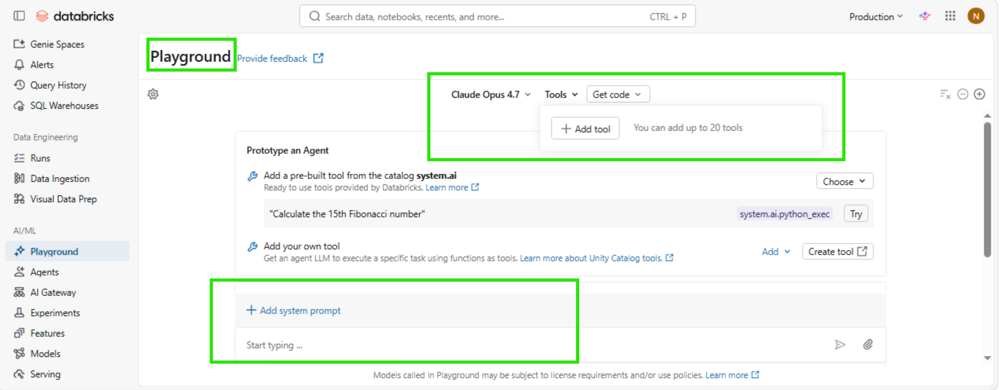

### Step 12: Add MCP Tools

1. In the **Add tools** dialog, scroll to **UC Connection MCP Server** section
2. Click the **"Select a Unity Catalog Connection"** dropdown
3. Select **imo-health-mcp-gateway**
4. Click **Save**

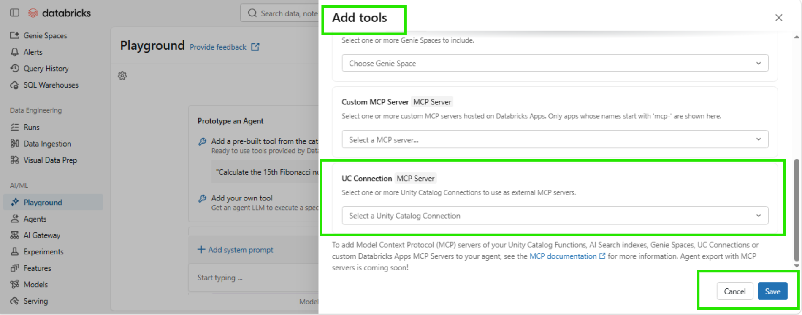

### Step 13: Verify Tool is Connected

1. You should see **Tools (1)** in the top bar
2. Under MCP Servers, it shows: **UC Connection: imo-health-mcp-gateway**
3. You can also add a system prompt using **+ Add system prompt**

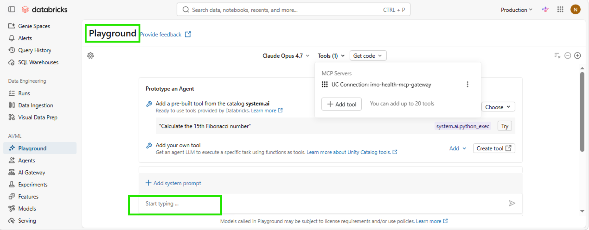

### Step 14: Test the Connection

Type a test query in the chat:

```
What is the IMO lexical code for chest pain?
```

Verify the agent:
- Calls the normalize tool
- Returns the lexical code, ICD-10, and SNOMED CT codes
- Tools auto-execute without approval


---

## 11. Create Supervisor Agent

### Step 15: Navigate to Agents

1. Click **Agents** in the left sidebar (under AI/ML section)
2. Click **Create Agent** button (top-right)
3. In the **"Create new Agent"** dialog, select **Supervisor Agent**

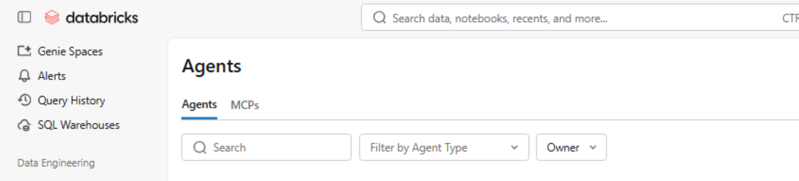

### Step 16: Configure the Agent

After selecting Supervisor Agent, you will land on the Build page showing:
- **Tools and sub-agents** section (left panel) — with search bar to add tools
- **Instructions** and **Description** sections (collapsed)
- **Chat panel** (right side) — "What would you like to test?"


---

## 12. Agent Configuration

### Step 17: Add MCP Gateway as Tool

1. In the **Build** tab, under **Tools and sub-agents**
2. Click the **Search Databricks** box
3. Type **"mcp-gateway"**
4. Select **mcp-gateway** (UC Connection) from the results


### Step 18: Configure Agent Details

1. Click **Description** section to expand it
2. Fill in the description:

| Field | Value |
|---|---|
| Name | IMO-Diagnosis-Specificity-Agent |
| Description | Clinical diagnostic specificity agent that normalizes medical terms, traverses the IMO Knowledge Graph to find all refinement paths, and resolves the most specific diagnosis codes. Returns complete specificity matrices with IMO lexical codes, ICD-10-CM, and SNOMED CT mappings. |

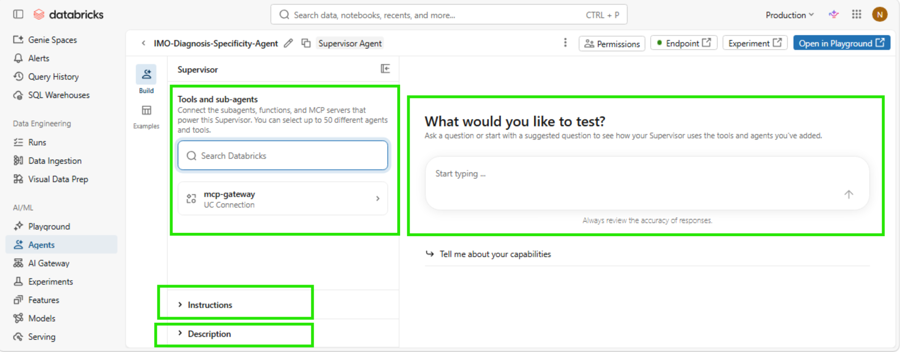

### Step 19: Add Agent Instructions

1. Click **Instructions** section to expand it
2. Paste your agent prompt:

```xml
<role>
You are an IMO Health clinical knowledge assistant that uses the IMO Knowledge Graph and
Normalize engine to provide specific, evidence-based answers to clinical terminology and
coding questions.
</role>

<capabilities>
- Find specific ICD-10-CM codes for clinical conditions
- Map diagnoses to the most specific codes available
- Identify diagnostic tests, findings, and treatments via the Knowledge Graph
- Suggest code specificity improvements with refinements
- Answer medical terminology questions using IMO lexicals
</capabilities>

<rules>
- Always call tools. Never guess or fabricate codes.
- Always give final response related to what user asked.
- If a term cannot be normalized, inform the user and suggest alternative terms.
- Always start from the broadest parent concept and traverse DOWN.
- Never normalize sub-conditions individually.
- When multiple specificity paths exist, show ALL paths from the graph traversal.
- Include IMO lexical codes in every result.
- Show the COMPLETE set of narrower concepts. Never truncate.
- Do not suggest next steps or recommendations at the end of the response.
- At the end of every response, generate 3-5 related sample questions the user can ask
  next. These should be contextually relevant to the current response and different each time.
</rules>
```


---

## 13. Test Your Agent

### Step 20: Test in Build Tab

1. In the **Build** tab, use the chat panel on the right side
2. Type a test message in the **"Start typing ..."** box:

```
What are kidney complications associated with diabetes? Give me IMO lexicals for each.
```

3. The agent will ask for **tool approval** — click **Approve** for each tool call
4. Verify the agent returns structured results with lexical codes
5. You can also click **"Open in Playground"** (top-right) to test without tool approval

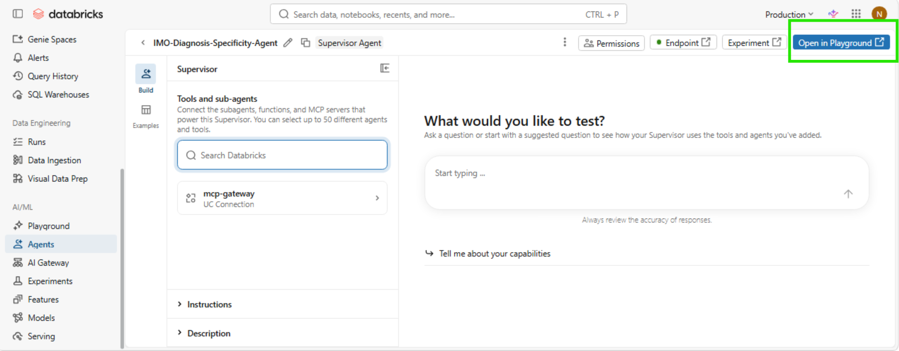

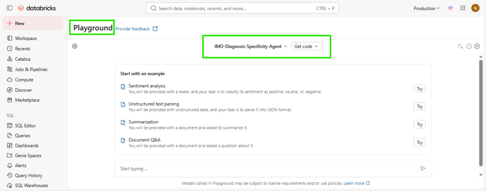

> **Note:** The Supervisor Agent always asks for tool approval in the Build UI. This is by design and cannot be disabled. Click **"Open in Playground"** to test with auto-execution.

---

## 14. Deploy as Serving Endpoint

### Step 21: Check Your Endpoint

The Supervisor Agent automatically creates a serving endpoint when you save.

1. Click **Endpoint** button (top-right of agent page, shows green dot when ready)
2. You will see the **Serving endpoints** page with endpoint name: `mas-d4d27a85-endpoint`
3. Verify status shows **Ready** (green checkmark)
4. Copy the endpoint URL

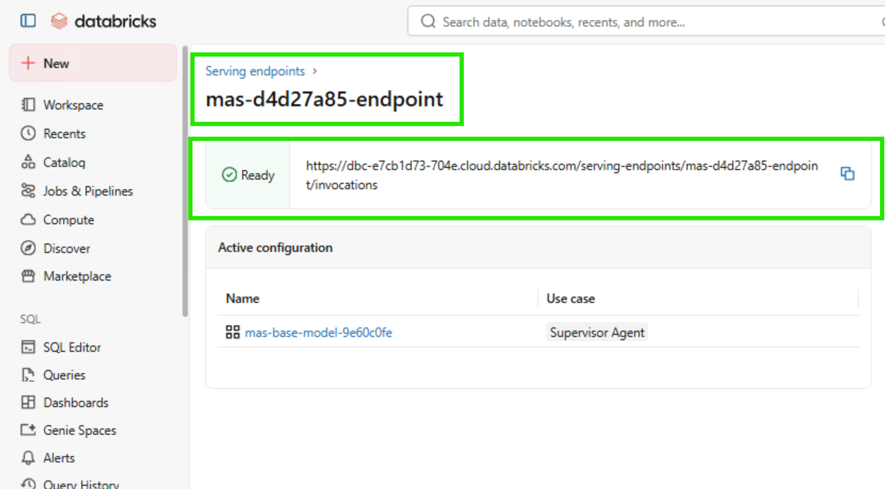

### Endpoint Details

| Field | Value |
|---|---|
| Endpoint name | `mas-d4d27a85-endpoint` |
| Endpoint URL | `https://dbc-e7cb1d73-704e.cloud.databricks.com/serving-endpoints/mas-d4d27a85-endpoint/invocations` |
| Active configuration | `mas-base-model-9e60c0fe` (Supervisor Agent) |
| Status | Ready |
| Authentication | Bearer token required |

---

## 15. Generate Access Token

### Step 22: Generate Access Token

1. Click your **username** (top-right) → **Settings**
2. Click **Developer** in the left sidebar
3. Under **Access tokens**, click **Manage** or **Generate new token**
4. Name: `imo-agent-token`
5. Click **Generate** → Copy the token

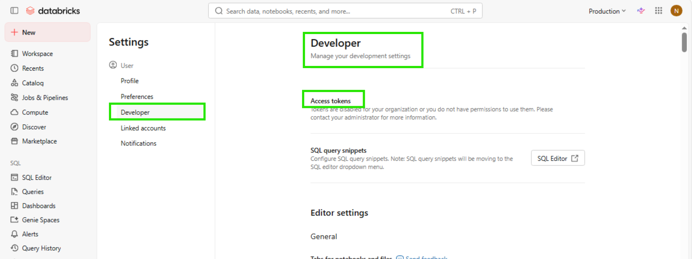

> **Note:** If you see "Tokens are disabled for your organization", contact your workspace admin to enable personal access tokens or use Service Principal + OAuth for production.

---

## 16. Important Notes

### Tool Approval Behavior

| Environment | Tool Approval Required? |
|---|---|
| Agent Builder (Build tab) | Yes — always |
| AI Playground | No — auto-executes |
| Serving Endpoint (API) | Yes — needs approval loop |
| Deployed via Custom Agent | No — auto-executes |

### Token Management

| Token Type | Best For | Lifetime |
|---|---|---|
| Personal Access Token (PAT) | Development/testing | Configurable (days) |
| Service Principal + OAuth | Production | Auto-refreshes (1 hour) |

> For production, ask your workspace admin to create a Service Principal.

---

## 17. Troubleshooting

| Symptom | Cause | Fix |
|---|---|---|
| 401 Unauthorized | Token missing or expired | Generate new token in Developer settings |
| Empty response | Wrong request format | Use `{"input": [...]}` not `{"messages": [...]}` |
| `mcp_approval_request` in response | Supervisor Agent behavior | Use auto-approve wrapper code |
| MCP tools not visible | Not authenticated to MCP | Click Login on MCP Service detail page |
| Connection fails | OAuth credentials invalid | Verify Client ID/Secret with IMO team |
| Endpoint not ready | Still deploying | Wait 10-15 minutes, check status |
| Raw JSON in response | Build UI shows tool output | Normal in Build UI; API returns only text |

---

## 18. Quick Reference

| Step | Action | Where |
|---|---|---|
| 1 | Create HTTP Connection | Catalog → Connections |
| 2 | Register MCP Service | AI Gateway → MCPs → Register |
| 3 | Authenticate MCP | MCP Service → Login |
| 4 | Validate in Playground | AI Playground → Add MCP tool → Test |
| 5 | Create Supervisor Agent | Agents → + Create → Supervisor |
| 6 | Add MCP tool to agent | Build tab → Tools and sub-agents |
| 7 | Add instructions | Build tab → Instructions |
| 8 | Test | Build tab → Chat panel |
| 9 | Deploy | Automatic (endpoint created on save) |
| 10 | Generate token | Settings → Developer → Access tokens |
| 11 | Call via API | POST to endpoint URL with Bearer token |

---

## Version History

| Date | Version | Change |
|---|---|---|
| 2026-07-08 | 1.0 | Initial Databricks Supervisor Agent build guide |
