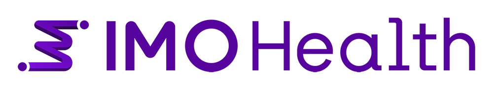

<div align="center">


# Solution Accelerators

**Production-ready blueprints for integrating IMO Health's clinical terminology, AI, and analytics APIs into healthcare applications.**

[](#clinical-ai--nlp)
[](#normalization--data-quality)
[](#clinical-coding--search)
[](#real-world-evidence)
[](#platform-integrations)


</div>

---

## Overview

Welcome to the **IMO Health Solution Accelerators** repository. This repository serves as a comprehensive collection of blueprints and solution accelerators that demonstrate how to integrate with IMO Health's powerful capabilities and APIs.

IMO Health provides industry-leading clinical terminology, analytics, and AI-powered solutions that help healthcare organizations improve clinical documentation, enhance data quality, and drive better patient outcomes. This repository contains practical, real-world implementations and reference architectures to help you quickly integrate IMO Health's capabilities into your healthcare applications and workflows.

---

## What's Inside

This repository contains **15 solution accelerators** organized into five categories — each with Jupyter notebooks, sample data, and step-by-step documentation to get you from zero to working integration.

<br>

> **New to IMO Health APIs?** Start with [Precision Normalize with Enrichment](Precision%20Normalize%20with%20Enrichment/README.md) for a quick intro to normalization, or [Knowledge Graph Traversal](knowledge-graph-accelerator/src/notebooks/Knowledge_Graph_Traversal/README.md) to explore the GraphQL API.

<br>

### Quick Navigation

| Category | Solutions | Description |
|:---------|:----------|:------------|
| [Clinical AI & NLP](#clinical-ai--nlp) | Ambient AI, Clinical NLP | Entity extraction, clinical documentation, problem list management |
| [Knowledge Graph & Diagnosis Intelligence](#knowledge-graph--diagnosis-intelligence) | KG Traversal, Diagnosis Inference, Dx-to-Meds, Rank Diagnosis | GraphQL-powered concept exploration, medication-based diagnosis workflows |
| [Normalization & Data Quality](#normalization--data-quality) | Normalize + Cohorting, Normalize + Enrichment | Precision normalization with FHIR value sets and contextual enrichment |
| [Clinical Coding & Search](#clinical-coding--search) | CodingIntelligence, Search and Capture | Code validation, CMS Excludes 1 detection, multi-domain clinical search |
| [Real-World Evidence](#real-world-evidence) | Medallion Architecture, HL7 Workflow, OMOP Workflow | Patient cohort identification from structured and unstructured data |
| [Platform Integrations](#platform-integrations) | Claude Code, Copilot Studio, Databricks, Codex Extension | MCP-powered AI agent integrations across developer platforms |

---

<br>

## Clinical AI & NLP

### 1. Ambient AI Solution

> End-to-end pipeline transforming clinical transcripts into structured, coded, billing-ready documentation.

**What it does:** Takes raw clinical conversation transcripts, generates SOAP notes using Amazon Bedrock, extracts clinical entities with context, normalizes them to standard terminologies, and runs diagnostic specificity workflows to produce billing-ready ICD-10 codes.

<table>
<tr><td>

**Key Capabilities**
- Transcript-to-SOAP note generation
- Entity extraction with clinical context
- Normalization with enrichment (ICD-10-CM, SNOMED CT)
- Diagnostic specificity workflow
- Billing-ready ICD-10 code output

</td><td>

**APIs & Tech**
- IMO Lexical Search API
- IMO Problem Normalization API
- IMO Specificity Check API
- Amazon Bedrock (Nova Pro)
- Python / Jupyter

</td></tr>
</table>

<a href="Ambient%20AI%20Solution/Readme.md"></a>

---

### 2. Clinical NLP

> Three-notebook workflow for extracting clinical entities, categorizing by specialty, and cleaning problem lists.

**What it does:** Processes unstructured clinical notes through a three-stage pipeline — extract entities mapped to ICD-10-CM, SNOMED-CT, RxNorm, CPT, and LOINC; categorize problems by medical specialty; then detect duplicates, stale entries, and related conditions for problem list hygiene.

<table>
<tr><td>

**Key Capabilities**
- Multi-domain entity extraction from free text
- Problem list categorization by specialty
- Duplicate and stale entry detection
- Related condition identification

</td><td>

**APIs & Tech**
- IMO Clinical AI (Entity Extraction)
- IMO Problem List Management (Categorize + Clean)
- ICD-10-CM, SNOMED-CT, RxNorm, CPT, LOINC
- Python / Jupyter

</td></tr>
</table>

<a href="Clinical%20NLP/README.md"></a>

---

<br>

## Knowledge Graph & Diagnosis Intelligence

### 3. Diagnosis Inference Using Medications

> LangGraph ReAct agent that infers the most specific diagnosis from a base diagnosis and patient medications via Knowledge Graph traversal.

**What it does:** Given an initial diagnosis and a list of medications, this agent iteratively drills down through the Knowledge Graph using `domainNarrowerByMedications` to find the most specific matching diagnosis. Supports multiple LLM backends (Bedrock, OpenAI, Anthropic, Azure) and includes an interactive chat mode.

<table>
<tr><td>

**Key Capabilities**
- Iterative diagnosis refinement via medications
- Multi-LLM support (Bedrock / OpenAI / Anthropic / Azure)
- Interactive chat mode
- Knowledge Graph `domainNarrowerByMedications` traversal

</td><td>

**APIs & Tech**
- IMO Precision Normalize API
- IMO Knowledge Graph GraphQL
- LangGraph / LangChain
- AWS Bedrock, OpenAI, Anthropic, Azure OpenAI

</td></tr>
</table>

<a href="Diagnosis-Inference-Using-Meds"></a>

---

### 4. Diagnosis to Medication Validation

> Validates whether a patient's medications are clinically associated with a given diagnosis using Knowledge Graph medication groups.

**What it does:** Normalizes a diagnosis and list of medications, queries the Knowledge Graph for `medicationGroups` associated with the diagnosis, then performs exact code-based matching (including parent codes) to produce an association validation report.

<table>
<tr><td>

**Key Capabilities**
- Diagnosis-to-medication association validation
- Direct + parent code matching
- KG `medicationGroups` query
- Structured validation report

</td><td>

**APIs & Tech**
- IMO Precision Normalize API
- IMO Knowledge Graph GraphQL
- Python / Jupyter

</td></tr>
</table>

<a href="Diagnosis-to-Medication"></a>

---

### 5. Rank Diagnosis Using Medications

> Ranks candidate diagnoses by medication evidence using a confidence scoring formula powered by the Knowledge Graph.

**What it does:** Normalizes patient medications and queries the Knowledge Graph for `treatedProblems`, `preventedProblems`, and `causedProblems` relationships. Applies hierarchy-aware code matching and a scoring formula to rank diagnoses as Strong, Moderate, Neutral, Weak, or Contraindicated.

<table>
<tr><td>

**Key Capabilities**
- Medication-based diagnosis ranking
- Confidence scoring (Strong / Moderate / Neutral / Weak / Contraindicated)
- Hierarchy-aware code matching
- Treated, prevented, and caused problem relationships

</td><td>

**APIs & Tech**
- IMO Precision Normalize API
- IMO Knowledge Graph GraphQL (MedicationLexical)
- Python / Jupyter

</td></tr>
</table>

<a href="Rank-Diagnosis-Using-Meds"></a>

---

### 6. Knowledge Graph Traversal

> Interactive notebook demonstrating direct GraphQL queries against the IMO Knowledge Graph API.

**What it does:** Walks through OAuth authentication, then demonstrates GraphQL queries for exploring concept hierarchies, cross-terminology mappings, and refinement relationships — with styled table output for easy exploration.

<table>
<tr><td>

**Key Capabilities**
- OAuth authentication setup
- Concept hierarchy exploration
- Cross-terminology mappings
- Refinement relationship queries

</td><td>

**APIs & Tech**
- IMO Knowledge Graph GraphQL API
- Python / Jupyter

</td></tr>
</table>

<a href="knowledge-graph-accelerator/src/notebooks/Knowledge_Graph_Traversal/README.md"></a>

---

<br>

## Normalization & Data Quality

### 7. Precision Normalize with Cohorting

> Three-notebook pipeline: normalize clinical terms, match against FHIR value sets, and build reproducible patient cohorts.

**What it does:** Takes raw clinical data through precision normalization to ICD-10-CM, SNOMED-CT, RxNorm, CPT, and LOINC codes. Then applies FHIR Value Set inclusion/exclusion criteria to identify patient cohorts for research and analytics.

<table>
<tr><td>

**Key Capabilities**
- Multi-terminology precision normalization
- FHIR Value Set inclusion/exclusion criteria
- Reproducible patient cohort generation
- Analytics-ready output

</td><td>

**APIs & Tech**
- IMO Precision Normalize API
- IMO Value Set Library (FHIR)
- ICD-10-CM, SNOMED-CT, RxNorm, CPT, LOINC
- Python / Jupyter

</td></tr>
</table>

<a href="Precision%20Normalize%20with%20Cohorting/README.md"></a>

---

### 8. Precision Normalize with Enrichment

> Context-aware clinical term normalization comparing enriched vs. base results.

**What it does:** Demonstrates how contextual metadata (patient age, care setting, medical specialty) improves normalization accuracy. Runs side-by-side comparisons of base vs. enriched results and flags concepts that may benefit from further refinement.

<table>
<tr><td>

**Key Capabilities**
- Context-aware enrichment normalization
- Side-by-side base vs. enriched comparison
- Refineable concept flagging
- Contextual metadata support (age, setting, specialty)

</td><td>

**APIs & Tech**
- IMO Precision Normalize Enrichment API
- Python / Jupyter

</td></tr>
</table>

<a href="Precision%20Normalize%20with%20Enrichment/README.md"></a>

---

<br>

## Clinical Coding & Search

### 9. CodingIntelligence

> Notebook workflow for validating diagnosis code sets and detecting CMS Excludes 1 conflicts.

**What it does:** Authenticates via OAuth, validates ICD-10-CM code sets for non-primary and unspecified codes, then detects CMS Excludes 1 conflicts — codes that cannot be reported together on a claim — producing a structured conflict report.

<table>
<tr><td>

**Key Capabilities**
- ICD-10-CM code validation
- Non-primary / unspecified code detection
- CMS Excludes 1 conflict reporting
- OAuth authentication workflow

</td><td>

**APIs & Tech**
- IMO Coding Intelligence API
- `imo-admin-coding-sets` endpoint
- `cms-excludes1` endpoint
- Python / Jupyter

</td></tr>
</table>

<a href="CodingIntelligence/README.md"></a>

---

### 10. Search and Capture

> Full clinical coding lifecycle — interactive term search, specialty grouping, duplicate detection, and code validation.

**What it does:** Provides an end-to-end clinical coding workflow: multi-domain search across diagnoses, procedures, medications, and labs with type-ahead suggestions; problem list categorization by specialty and cleanup (duplicates, stale entries); then CMS Excludes 1 conflict detection and code validation.

<table>
<tr><td>

**Key Capabilities**
- Multi-domain clinical search with type-ahead
- Problem list categorization + cleanup
- CMS Excludes 1 conflict detection
- Code validation pipeline

</td><td>

**APIs & Tech**
- IMO Core Search API
- IMO Problem List Management (Categorize + Clean)
- IMO Coding Intelligence
- Python / Jupyter

</td></tr>
</table>

<a href="Search%20And%20Capture/README.md"></a>

---

<br>

## Real-World Evidence

### 11. RWE Cohort Identification

> Three approaches to patient cohort identification from different data sources and architectures.

<br>

<details>
<summary><strong>11a. Medallion Architecture (Data Lake)</strong> — Bronze/Silver/Gold pipeline for scalable data processing and cohort identification</summary>

<br>

**What it does:** Implements a full medallion architecture (Bronze/Silver/Gold) on AWS S3 for ingesting raw clinical data, normalizing it through IMO Precision APIs, and applying FHIR Value Set cohort criteria at scale.

**Key Capabilities:**
- Bronze/Silver/Gold data lake pipeline
- Scalable normalization at each tier
- FHIR Value Set cohort criteria
- AWS S3 storage backend

**APIs & Tech:** IMO Precision API, AWS S3, FHIR ValueSets, Python / Jupyter

<a href="RWE-Cohort-Identification/PythonNotebooks/Cohort-Identification-using-DataLake-Medallion-Architecture/README.md"></a>

</details>

<details>
<summary><strong>11b. HL7 Workflow</strong> — Parse HL7 v2.x messages, extract/normalize codes, and apply cohort criteria</summary>

<br>

**What it does:** Parses HL7 v2.x messages to extract clinical data, normalizes medical codes through IMO Precision APIs, and applies FHIR-based cohort inclusion/exclusion criteria.

**Key Capabilities:**
- HL7 v2.x message parsing
- Medical code extraction and normalization
- FHIR-based cohort criteria
- End-to-end pipeline from raw HL7 to cohort

**APIs & Tech:** IMO Precision API, hl7apy, FHIR ValueSets, Python / Jupyter

<a href="RWE-Cohort-Identification/PythonNotebooks/Cohort-Identification-using-HL7-Data/README.md"></a>

</details>

<details>
<summary><strong>11c. OMOP Workflow</strong> — Extract entities from clinical notes, convert to OMOP CDM, and identify cohorts</summary>

<br>

**What it does:** Uses IMO's NLP API to extract structured entities from clinical notes, maps them to the OMOP Common Data Model using OHDSI Athena vocabularies, then applies cohort criteria for research-ready patient identification.

**Key Capabilities:**
- NLP entity extraction from clinical notes
- OMOP CDM conversion
- OHDSI Athena vocabulary mapping
- Cohort criteria application

**APIs & Tech:** IMO NLP API, OMOP CDM, OHDSI Athena, FHIR ValueSets, Python / Jupyter

<a href="RWE-Cohort-Identification/PythonNotebooks/PatientData-To-OMOP-And-Cohort-Identification/README.md"></a>

</details>

---

<br>

## Platform Integrations

> Connect IMO Health's clinical intelligence to your preferred AI development platform via the **IMO MCP Server** (Model Context Protocol).

<br>

<table>
<tr>
<td align="center" width="25%">

**Claude Code**

<br>


17 MCP tools, plugin-based setup, diagnostic specificity agents, natural language clinical queries

<br>

<a href="MCP-Claude-Code/Readme.md">View Guide</a>

</td>
<td align="center" width="25%">

**Microsoft Copilot Studio**

<br>


Low-code agent building, MCP server integration, diagnostic specificity workflows

<br>

<a href="IMO-Copilot-Studio/README.md">View Guide</a>

</td>
<td align="center" width="25%">

**Databricks**

<br>


Unity Catalog integration, Supervisor Agent orchestration, production serving endpoints

<br>

<a href="IMO-Databricks/README.md">View Guide</a>

</td>
<td align="center" width="25%">

**OpenAI Codex (VS Code)**

<br>


15 MCP tools inside VS Code, OAuth authentication, natural language clinical queries in IDE

<br>

<a href="IMO-Codex-Using-Extension/Codex_Extension_BuildGuide.md">View Guide</a>

</td>
</tr>
</table>

---

<br>

## IMO Health APIs at a Glance

| API | What it Does | Used In |
|:----|:-------------|:--------|
| **Precision Normalize** | Maps clinical terms to ICD-10-CM, SNOMED-CT, RxNorm, CPT, LOINC | Ambient AI, Cohorting, Enrichment, RWE, Diagnosis solutions |
| **Knowledge Graph (GraphQL)** | Concept hierarchies, medication relationships, cross-terminology mappings | KG Traversal, Diagnosis Inference, Dx-to-Meds, Rank Diagnosis |
| **Clinical AI / NLP** | Entity extraction from unstructured clinical text | Clinical NLP, RWE (OMOP Workflow) |
| **Core Search** | Multi-domain clinical terminology search with type-ahead | Search and Capture |
| **Problem List Management** | Categorization by specialty, duplicate/stale detection, cleanup | Clinical NLP, Search and Capture |
| **Coding Intelligence** | ICD-10-CM validation, CMS Excludes 1 conflict detection | CodingIntelligence, Search and Capture |
| **Specificity Check** | Diagnostic specificity and modifier workflows | Ambient AI, MCP Integrations |
| **Value Set Library (FHIR)** | FHIR R4 value set inclusion/exclusion criteria | Cohorting, RWE solutions |
| **MCP Server** | Model Context Protocol server exposing 15-17 clinical tools | Claude Code, Copilot Studio, Databricks, Codex Extension |

---

<br>

## Getting Started

Each solution accelerator includes everything you need to get up and running:

| | |
|:--|:--|
| **Jupyter Notebooks** | Step-by-step implementations with inline documentation |
| **Sample Data** | Example clinical data and configuration files |
| **README Documentation** | Detailed setup instructions and architecture overview |
| **Requirements** | Python dependencies and API credential setup |

### Prerequisites

| Requirement | Details |
|:------------|:--------|
| **Python** | 3.8 or higher |
| **Jupyter** | Notebook or Lab environment |
| **IMO Health APIs** | [Contact us](mailto:support@imohealth.com) for API credentials |
| **Cloud (optional)** | Azure subscription or AWS account for cloud-based solutions |

### Repository Structure

```
solution-accelerators/
├── Ambient AI Solution/                  # Clinical transcript to coded documentation
├── Clinical NLP/                         # Entity extraction & problem list management
├── CodingIntelligence/                   # Code validation & CMS Excludes 1 detection
├── Diagnosis-Inference-Using-Meds/       # LangGraph agent for diagnosis refinement
├── Diagnosis-to-Medication/              # Medication-diagnosis association validation
├── IMO-Codex-Using-Extension/            # OpenAI Codex + IMO MCP integration
├── IMO-Copilot-Studio/                   # Microsoft Copilot Studio + IMO MCP
├── IMO-Databricks/                       # Databricks AI Agent + IMO MCP
├── knowledge-graph-accelerator/          # GraphQL Knowledge Graph exploration
├── MCP-Claude-Code/                      # Claude Code + IMO MCP plugin
├── Precision Normalize with Cohorting/   # Normalization + FHIR value set cohorting
├── Precision Normalize with Enrichment/  # Context-aware enrichment normalization
├── Rank-Diagnosis-Using-Meds/            # Medication-based diagnosis ranking
├── RWE-Cohort-Identification/            # Real-world evidence cohort pipelines
│   ├── Medallion Architecture/           #   └── Data lake Bronze/Silver/Gold
│   ├── HL7 Workflow/                     #   └── HL7 v2.x message processing
│   └── OMOP Workflow/                    #   └── Clinical notes to OMOP CDM
├── Search And Capture/                   # End-to-end clinical search & coding
└── static/                               # Branding assets
```

---

<br>

## Contact

<p align="center">

**IMO Health**

<a href="https://www.imohealth.com"></a>
<a href="mailto:support@imohealth.com"></a>
<a href="https://www.linkedin.com/company/imohealth/posts/"></a>

</p>

<p align="center">
For technical support or partnership inquiries, contact our Solution Engineering team at <a href="mailto:support@imohealth.com">support@imohealth.com</a>.
</p>

---

<br>

## License

Copyright &copy; 2026 IMO Health. All rights reserved.

<br>

## About IMO Health

IMO Health is a leading provider of clinical terminology, analytics, and AI-powered solutions for healthcare organizations. Our comprehensive suite of products and services helps healthcare providers improve clinical documentation quality, enhance operational efficiency, and deliver better patient care through advanced data normalization and clinical intelligence.

<p align="center">
  
</p>
